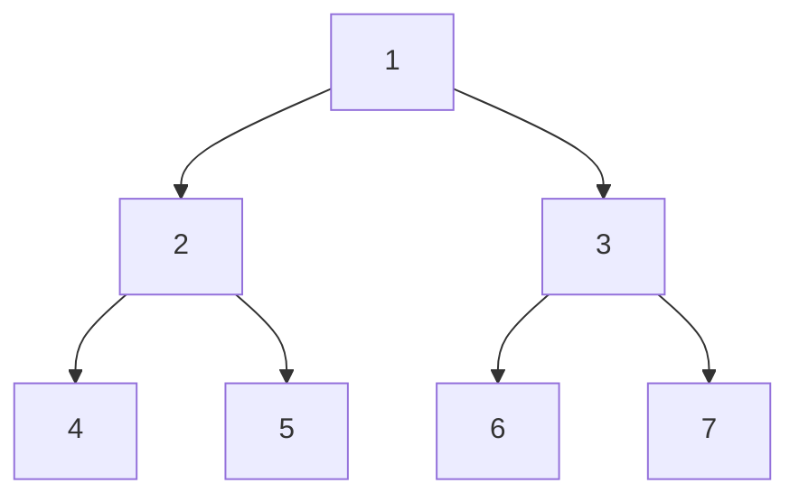

# 测验2


### 考点1

给定一个集合，让构建一个merkle tree，试证明3属于这个集合


Eg.

$A=\{3,9,6,8,5,10,2,13\}$

构建一棵merkle tree，试证明$3\in A$

（试证者有整棵树的信息，验证者只有根节点的hash值）

这个树怎么用数组存，完全二叉树

节点




x, 从1开始记录

左右儿子：2x, 2x+1


要找兄弟的话，根据奇偶性来判断


The response is from the web search results.

满二叉树是一种特殊的二叉树，它的每一层的结点数都达到最大值，也就是说，深度为k的满二叉树有 (2^k)-1个结点¹。满二叉树可以用数组来存储，因为它没有空缺的结点。数组存储满二叉树的方法是：将根节点存放在下标为1的位置，然后按照从上到下、从左到右的顺序依次存放其他结点。这样，对于任意一个下标为i的结点，它的左子节点在下标为2i的位置，它的右子节点在下标为2i+1的位置，它的父节点在下标为i/2（向下取整）的位置。

余数0证据找左子树，余数1证据找右子树

```java
class MerkleTree {
    int[] merkle;
    int N;
    public MerkleTree(int nums) {
        
    }
    
}
```


```java
public class SimpleMerkleTree {
    public static class Node {
        private final Node left;
        private final Node right;
        private final byte[] value;

        public Node(final Node left, final Node right, final byte[] value) {
            this.left = left;
            this.right = right;
            this.value = value;
        }

        public Node getLeft() {
            return left;
        }

        public Node getRight() {
            return right;
        }

        public byte[] getValue() {
            return Arrays.copyOf(value, value.length);
        }

        @Override
        public boolean equals(Object o) {
            if (this == o) return true;
            if (o == null || getClass() != o.getClass()) return false;
            Node node = (Node) o;
            return Objects.equals(left, node.left) && Objects.equals(right, node.right) && Arrays.equals(value, node.value);
        }

        @Override
        public int hashCode() {
            int result = Objects.hash(left, right);
            result = 31 * result + Arrays.hashCode(value);
            return result;
        }
    }

    private final Node root;

    public SimpleMerkleTree(final Function<byte[], byte[]> hashFunction, final byte[][] values) {
        if (0 == values.length) {
            throw new IllegalArgumentException("Must specify at least one value");
        }

        List<Node> currentLevel = Stream.of(values)
                .map(hashFunction)
                .map(hash -> new Node(null, null, hash))
                .collect(Collectors.toList());

        while (1 < currentLevel.size()) {
            final List<Node> nextLevel = new ArrayList<>();

            for (int nodeIndex = 0; nodeIndex < currentLevel.size(); nodeIndex += 2) {
                final Node firstNode = currentLevel.get(nodeIndex);

                if (currentLevel.size() - 1 == nodeIndex) {
                    nextLevel.add(new Node(firstNode, null, firstNode.value));
                } else {
                    final Node secondNode = currentLevel.get(1 + nodeIndex);

                    nextLevel.add(
                            new Node(
                                    firstNode,
                                    secondNode,
                                    hashFunction.apply(concatenate(firstNode.value, secondNode.value))
                            )
                    );
                }
            }

            currentLevel = nextLevel;
        }

        this.root = currentLevel.get(0);
    }

    public Node getRoot() {
        return root;
    }

    private static byte[] concatenate(final byte[] first, final byte[] second) {
        final int firstLength = first.length;
        final int secondLength = second.length;
        final byte[] concatenated = new byte[firstLength + secondLength];
        System.arraycopy(first, 0, concatenated, 0, firstLength);
        System.arraycopy(second, 0, concatenated, firstLength, secondLength);

        return concatenated;
    }

    @Override
    public boolean equals(Object o) {
        if (this == o) return true;
        if (o == null || getClass() != o.getClass()) return false;
        SimpleMerkleTree that = (SimpleMerkleTree) o;
        return Objects.equals(root, that.root);
    }

    @Override
    public int hashCode() {
        return Objects.hash(root);
    }
}
```


叶子结点的原编号的求法：

每次除2的余数，组成的二进制数，就是他原本的编号

