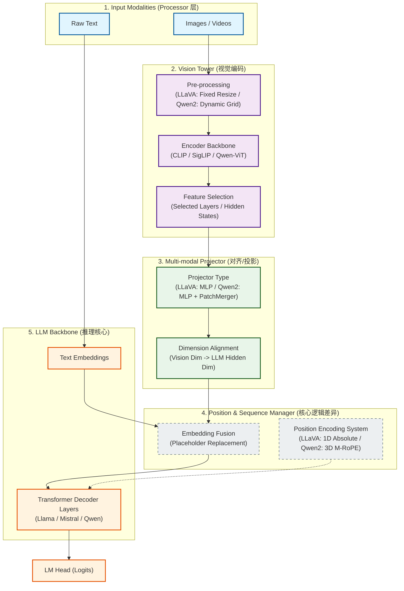
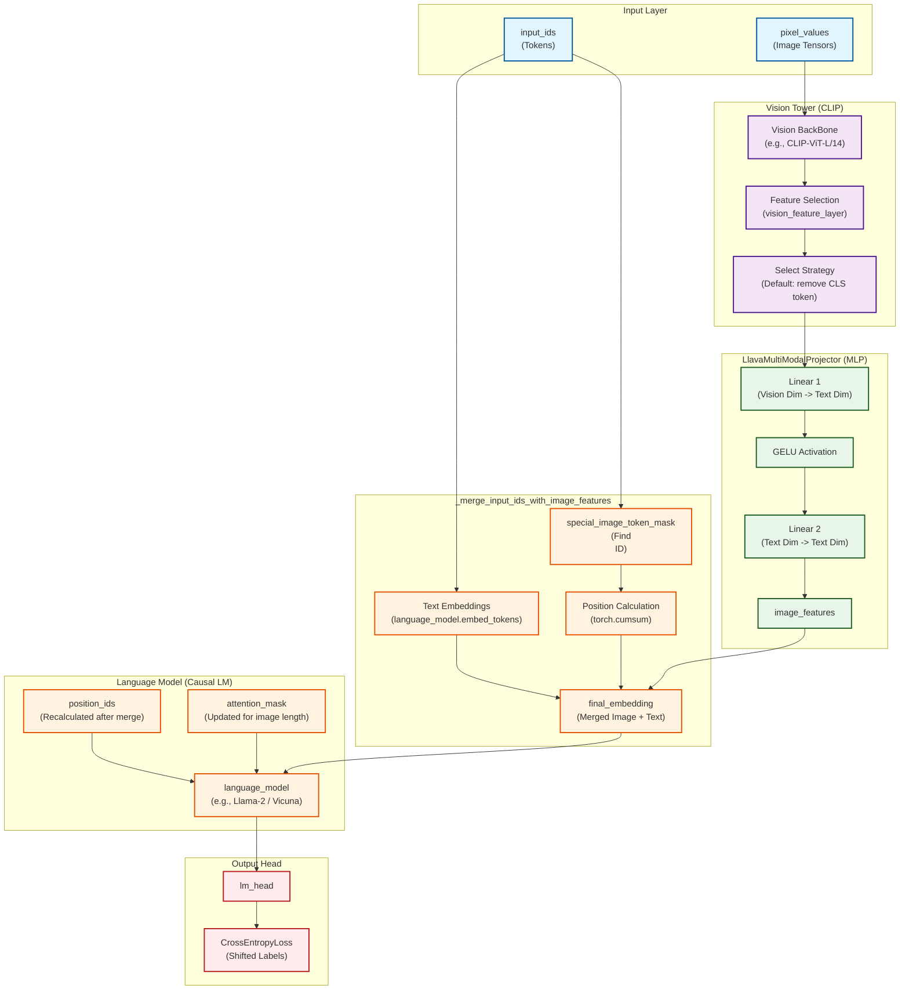
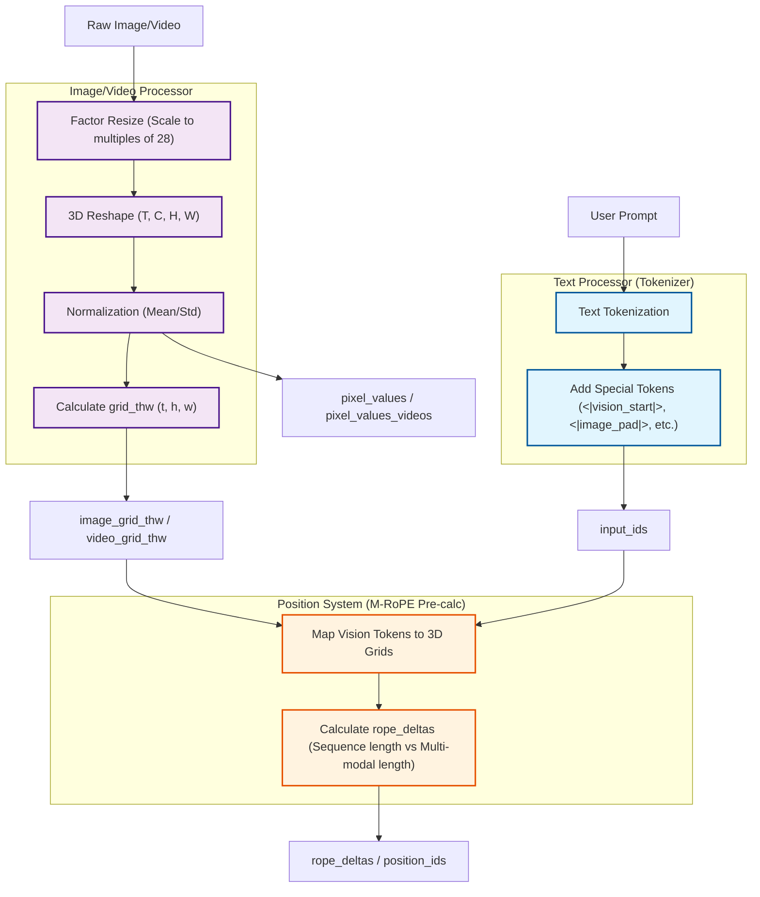
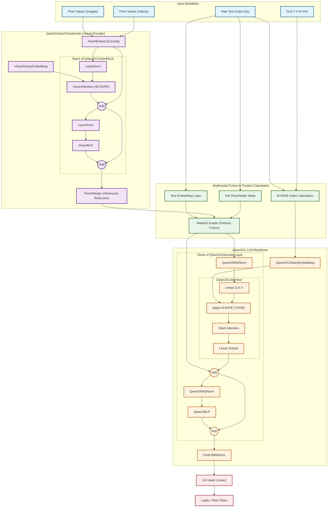

# FeedForward

主流模型采用 **SwiGLU** 激活函数，包含三个投影矩阵。

- **参数名称**：

  - $W_G$: `gate_proj`
  - $W_U$: `up_proj`
  - $W_D$: `down_proj`

- **参数量**：$3 \times (d \times d_{ff})$

- 公式：
  $$
  \text{SwiGLU}(X) = (\text{SiLU}(X \cdot W_G) \otimes (X \cdot W_U)) \cdot W_D
  $$

- **意义**：$W_G$ 和 $W_U$ 将空间维度升采样，通过门控过滤信息，$W_D$ 负责将信息压缩回 $d$ 维。

FFN 存储了模型大部分的“知识点”。

- **激活函数演进**：ReLU $\rightarrow$ GELU $\rightarrow$ **SwiGLU** (Llama、Qwen 标配)。
- **结构演进 (MoE - Mixture of Experts)**：
  - **Mixtral / DeepSeek-V3**：将大的 FFN 拆成多个专家，每次只激活一小部分。
  - **细粒度专家**：DeepSeek 将专家拆得更细，并引入“共享专家”处理通用知识，解决了专家路由的负载均衡问题。
- **MTP (Multi-Token Prediction)**：DeepSeek-V3 在 FFN 层之后引入多 Token 预测分支，增强了模型对上下文的整体规划能力。

## Activation

## MoE (Mixture of Experts)

MoE 的核心思路是：**在不增加单次推理计算量（FLOPs）的前提下，大幅增加模型参数量（存储能力）。**

1. **早期尝试 (Switch Transformer/GShard)**：
   - **机制**：Top-1 路由，将 Token 发给最匹配的一个专家。
   - **问题**：训练极不稳定，容易出现“专家坍塌”（所有 Token 都挤给一个专家，其他专家不学习）。
2. **主流阶段 (Mixtral 8x7B)**：
   - **机制**：Top-2 路由。每个 Token 激活 2 个专家。
   - **贡献**：确立了 **Sparse MoE** 的工业化标准，开源性能首次反超某些闭源稠密模型。
3. **精细化阶段 (DeepSeek-MoE)**：
   - **创新**：引入 **共享专家 (Shared Experts)** + **细粒度专家 (Fine-grained Experts)**。
   - **逻辑**：总有 2 个专家是“常驻”的，负责处理通用语法和基础知识；剩下的 62 个专家中选出 6 个，负责特定领域。这避免了每个专家都要重复学习“的、地、得”这种废话。
4. **原生多模态 MoE (Llama 4 / Qwen 3)**：
   - **改进**：专家不再只是处理文本。模型内部会出现“视觉专家”、“代码专家”、“逻辑推理专家”，且支持在训练时动态扩展专家数量（Dynamic Scaling）。

MOE 特点

- 相同计算代价下，可以增大网络参数规模，性能更好。
- 基本可以达到相同参数规模的稠密网络性能。
- 相比同等参数规模的稠密网络，计算代价变小。
- 相比同等参数规模的稠密网络，显存占用不变。
- 可能有专家负载不均衡问题，训练难度增大。

### 专家负载均衡

- 训练时对每个tokent最少选择2个专家。选择Top1专家和在剩余专家里按概率再选择一个。
- 给每个专家设置tokn容量，达到容量后，则跳过处理，输出为全0。通过残差连接后边。
- 设置一个负载均衡的辅助损失。

### 负载均衡衡损失

- 希望每个专家被调用的频率是相等的。
- $f_i=(该专家被调用的次数)/(所有专家被调用的次数)$
- $loss_{balance}=\sum\limits^N_{i=1}(f_i)^2$
- 假设有2个专家：
  - f1=1;f2=0;losspalance =12+02=1
  - f1=0.8;f2=0.2;l0 SSpalance=0.82+0.22=0.68
  - f1=0.5;f2=0.5;l0 SSpalance=0.52+0.52=0.5

#### fi

- $f_i=(该专家被调用的次数)/(所有专家被调用的次数)$
- $loss_{balance}=\sum\limits^N_{i=1}(f_i)^2$

是否调用某个专家是通过torch.topk操作得到的，这个操作不可微，无法通过梯度下降优化。

#### 近似

$loss_{balance}=\sum\limits^N_{i=1}f_ip_i$

- $f_i=(该专家被调用的次数)/(所有专家被调用的次数)$
- $p_i=$ 一个批次中所有token对该专家的路由概率的平均值。
  - 这个是softmax得到的，可微，f作为常数，对pi优化

### DeepSeek MoE

- 细分更多专家
- 抽取共享专家

效果已经达到MoE极限：与Dense网络loss一致

## MTP (Multi-Token Prediction)

- 只在训练时使用，用来加速训练，
- 推理的时候用vllm可以自动分batch处理多用户同时访问，不必 mtp