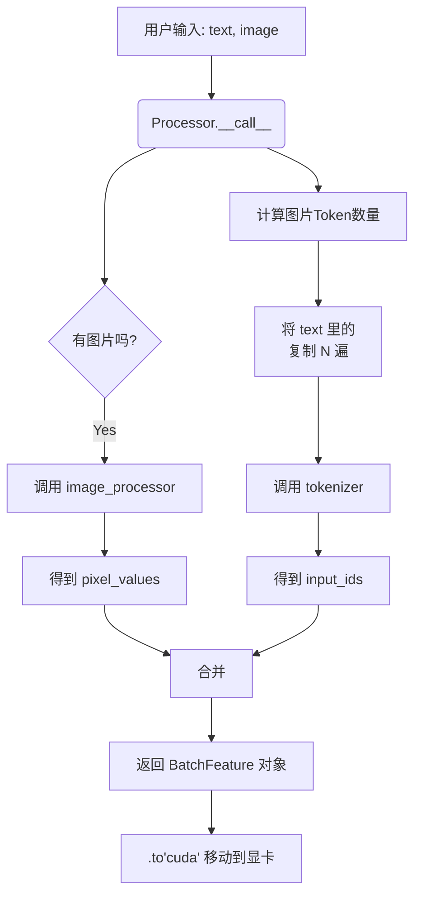
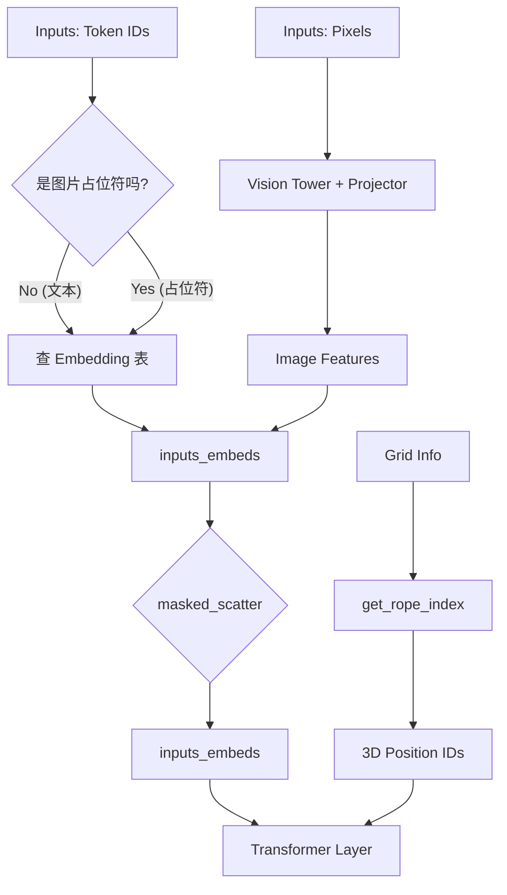

# LLaVA

LLaVA（Large Language and Vision Assistant）是一个多模态大模型，结合了视觉编码器（Vision Encoder）和大型语言模型（LLM），用于实现图像理解和视觉问答等任务。其核心思想是将图像通过视觉编码器编码为向量表示，然后与文本输入一起送入语言模型进行联合推理。

高分辨率图像：

- 拆分 => Embedding
- 缩放 => Embedding

---

- LLaVA
- LLaVA-Med
- LLaVA-1.5
- LLaVA-NeXT
- LLaVA-OneVision

Sss

## 架构

### 整体架构

LLaVA 的典型结构包括两个主要模块：

- **Vision Encoder（视觉编码器）**：负责将输入图像编码为特征向量。
- **Language Model（语言模型）**：通常是基于 LLaMA 或其变种的 Decoder-only Transformer，用于理解文本并生成回答。

两者之间通过一个 **投影层（Projector）** 连接，将视觉特征映射到语言模型的嵌入空间。

---

### 模块详解

#### Vision Encoder

- **默认使用模型**：CLIP ViT-L/14（OpenAI 的 CLIP 模型）
- **具体配置**：
  - 架构：Vision Transformer (ViT)
  - 层数（Layers）：24
  - 隐藏层维度（Hidden size）：768
  - 注意力头数（Heads）：12
  - Patch size：14×14
  - 输入图像尺寸：336×336（LLaVA-1.5 中将原始 224×224 升级为 336×336 以提升分辨率）
- **参数量**：约 **304M（0.3B）**
- **是否可训练**：在 LLaVA-1.5 中，**vision encoder 通常被冻结（frozen）**，不参与微调，仅用作特征提取器。

> 注：早期 LLaVA-1.0 使用 ViT-L/14 @ 224×224；LLaVA-1.5 升级到 336×336，但 encoder 本身结构未变，只是输入分辨率更高，通过插值调整位置编码。

---

#### Projection Layer

$$
y = W_2 \cdot \text{ReLU}(W_1 x + b_1) + b_2
$$

- **作用**：将 vision encoder 输出的图像 token（如 256 个 patch tokens）映射到 LLM 的词嵌入空间。
- **结构**：通常是一个 **两层 MLP（Multi-Layer Perceptron）**
  - 输入维度：768（来自 ViT）
  - 输出维度：LLM 的隐藏维度（如 LLaMA-7B 为 4096）
  - 中间层维度：常设为 4096 或 768 → 4096 → 4096
- **参数量**：约 **33M**
  - 计算：(768 × 4096) + (4096 × 4096) ≈ 3.15M + 16.78M ≈ **20M–35M**（取决于具体设计）
- **是否可训练**：**是**，这是 LLaVA 微调时唯一新增且可训练的视觉相关参数。

---

#### Language Model

LLaVA 支持多种 LLM 主干，常见配置包括：

| LLM 主干      | 参数量                    | 隐藏维度（hidden_size） | 是否可训练                                  |
| ------------- | ------------------------- | ----------------------- | ------------------------------------------- |
| LLaMA-7B      | ~7B                       | 4096                    | **部分或全部微调**（通常全参数微调或 LoRA） |
| LLaMA-13B     | ~13B                      | 5120                    | 同上                                        |
| Vicuna-7B/13B | 基于 LLaMA 微调的对话模型 | 同上                    | 同上                                        |

> 在标准 LLaVA 训练中，**整个 LLM 通常是可训练的**（尤其在指令微调阶段），但也有研究使用 LoRA 等高效微调方法减少显存消耗。

---

### 总参数量

- Vision Encoder（冻结）：~0.3B（不计入可训练参数）
- Projection Layer（可训练）：~33M
- LLM（Vicuna-7B，可训练）：~7B

✅ **可训练参数总量 ≈ 7.03B**  

✅ **总模型参数（含冻结）≈ 7.33B**

| 模块           | 模型          | 参数量 | 是否训练 | 备注               |
| -------------- | ------------- | ------ | -------- | ------------------ |
| Vision Encoder | CLIP ViT-L/14 | ~304M  | ❌        | 输入 336×336       |
| Projector      | 2-layer MLP   | ~33M   | ✅        | 对齐视觉与语言空间 |
| Language Model | Vicuna-7B/13B | 7B/13B | ✅        | 基于 LLaMA         |

---

### 输入处理流程简述

1. 图像 → Resize to 336×336 → 输入 ViT-L/14 → 输出 [1 + 576] tokens（class token + 576 patch tokens，因 336/14=24, 24×24=576）
2. 通常丢弃 class token，保留 576 个 patch tokens
3. 通过 projection layer 映射为 576 个 LLM 嵌入向量（维度 4096）
4. 文本 prompt 被 tokenized，其中 `<image>` 占位符被替换为上述 576 个视觉 token
5. 拼接后的序列输入 LLM，进行自回归生成

---

### 其他变体说明

- **LLaVA-NeXT / LLaVA-1.6**：引入更强的 vision encoder（如 EVA-CLIP、SigLIP）或更高分辨率（如 672×672），投影层也可能变为更复杂的结构（如 Q-Former、resampler）。
- **MiniGPT-4、mPLUG-Owl 等**：类似架构，但 projector 设计不同。

如果你关注的是 LLaVA 的某个特定版本（如 LLaVA-NeXT、LLaVA-OneVision 等），也可以进一步说明，我可以提供对应细节。

## LLaVA

Visual Instruction Tuning

### Visual Instruction Generation

Context type 1: Captions

A group of people standing outside of a black vehicle with various luggage.

Luggage surrounds a vehicle in an underground parking area

People try to fit all of their luggage in an SUV.

The sport utility vehicle is parked in the public garage, being packed for a trip

Some people with luggage near a van that is transporting it.

Context type 2: Boxes

person: [0.681, 0.242, 0.774, 0.694], backpack: [0.384, 0.696, 0.485, 0.914], suitcase: …(omitted)

### 训练

1. Stage 1: Pre-training for Feature Alignment.

   冻结 Vision Encoder, LLM

   训练 MLP

2. Stage 2: Fine-tuning End-to-End.

   冻结 Vision Encoder

   训练 MLP

## LLaVA-1.5

Improved Baselines with Visual Instruction Tuning

Llava1.5 是llava 的升级 全称 《Improved Baselines with Visual Instruction Tuning》, 是一个多模态视觉-文本大语言模型，可以完成：图像描述、视觉问答、根据图片写代码 (HTML、JS、CSS) , 潜在可以完成单个目标的视觉定位、名画名人等识别 (问答、描述) 。支持单幅图片输入 (可以作为第一个或第二个输入) , 多轮文本对话。

本文基于CLIP的视觉编码器, 以及LLaMa语言解码器, 使用最简单的**两层FC**构成MLP (Ilava是一层) 映射视觉特征到文本长度，构建了一个大规模的多模态模型, 并且将该模型在指令视觉-语言数据上进行了微调 (数据集更丰富) , 并且通过增加特定指令来解决简单回答指令的跟随性。

亮点

- 用最简单的架构、
- 公共数据集、
- 小的计算资源消耗
- 实现了最佳性能, 
- 为未来的研究提供了完全可复制和负担得起的基线

### HD

- 分小片
- 缩放完整图

## LLaVA-NeXT

LLaVA-NeXT: Improved reasoning, OCR, and world knowledge

1. **Increasing the input image resolution** to 4x more pixels. This allows it to grasp more visual details. It supports three aspect ratios, up to 672x672, 336x1344, 1344x336 resolution.
2. **Better visual reasoning and OCR capability** with an improved visual instruction tuning data mixture.
3. **Better visual conversation for more scenarios**, covering different applications. Better world knowledge and logical reasoning.
4. **Efficient deployment and inference** with [SGLang](https://github.com/sgl-project/sglang).

## LLaVA-NeXT-Interleave

Interleaved

multi-image scenarios

模型接受交错格式输入：`[img][text][img][text]...`，其中：

- `img`：图像标记，对应图像的视觉特征
- `text`：文本标记，对应文本内容

对于视频，每帧图像被视为一个独立的`img`；对于3D，不同视角的图像被视为多个`img`。

架构

- **视觉编码器**：SigLIP-400M（384×384分辨率）
- **语言模型**：Qwen 1.5（0.5B/7B/14B参数）
- **投影层**：两层MLP

**SFT**

1. Technique 1: Continue training from single-image models
2. Technique 2: Mixed Interleaved data formats during training
3. Technique 3: Combining different data scenarios improves individual task performance.

### Interleaved Format

## LLaVA-OneVision

- ***LLM***. We choose **Qwen-2** as our LLM fϕ(·) parameterized by ϕ, as it offers various model size and exhibits strong language capabilities to date among publicly available checkpoints.
- ***Vision Encoder***. We consider the **SigLIP** as the visual encoder gψ(·) parameterized by ψ, encoding an input image Xv into its visual feature Zv = g(Xv). The grid features before and after the last Transformer layer are considered in our experiments.
- ***Projector***. We consider a **2-layer MLP** pθ(·) parameterized by θ, to project image features into the word embedding space, yielding a sequence of visual tokens Hv = p(Zv).

### AnyRes

Higher AnyRes with Bilinear Interpolation