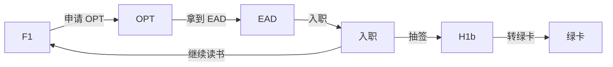
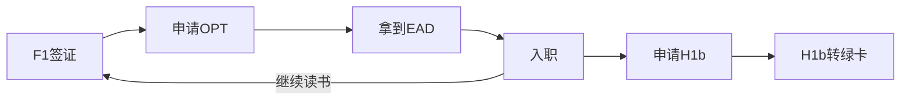

# 签证

F-1

CPT(curriculum practical training)

OPT(Optional Practical Training)

pre-OPT

H1b

NIW

EB1

F1 → 申请 OPT → 拿到 EAD → 入职 → 申请 H1b 或继续读书 → H1b 转绿卡

1. **非移民签证**：临时访问美国的人员，包括旅游、商务、工作和学习等目的。

   - **B-1/B-2签证**：用于商务（B-1）和旅游、探亲或医疗治疗（B-2）。

   - **F-1和M-1签证**：分别用于学术学生和职业学生。

     - CPT
     - OPT
       - pre-OPT

   - **H-1B签证**：用于在特定专业职位工作的专业人士。

     Sponsor，抽签

     - **名额限制**：H-1B签证每财政年度有名额上限。目前，常规名额限制为65,000，另外对拥有美国高等教育机构学位的申请人有20,000个额外名额。

   - **J-1签证**：用于交换访问学者、学生、实习生等。

   - **L-1签证**：用于跨国公司内部调动的员工。

   - **O-1签证**：用于具有杰出能力的个人，如艺术家、科学家、商业领袖等。

2. **移民签证**：打算永久居住在美国的人员。

   - **亲属移民签证**：美国公民和合法永久居民可以为亲属申请。

   - **就业移民签证**(Employment-Based)：基于雇佣的各类别，包括优先工人、专业人士等。

     - EB-1

       - EB-1A

     - EB-2 雇主担保移民

       - NIW

     - **EB-3** 技术类移民

       day 1 perm类公司就是这一类，如flag

       但如果发生裁员，则短期内不能办理 perm

     - EB-5 投资移民

   - **多样性签证（DV）**：通过随机抽签方式，提供给低移民率国家的人民。

3. **特殊类别签证**：如外交签证（A、G类）、特定国际组织的员工签证等。

4. **过境/机组人员签证**：如C-1过境签证和D-1/D-2机组人员签证。

### F-1

### CPT

[Cornell CPT policy](https://international.globallearning.cornell.edu/employment-and-taxes/f-1-cpt)

- You've been in full-time student status for at least one academic year (two full semesters) before you apply.

### OPT

[cornell OPT policy](https://international.globallearning.cornell.edu/employment-and-taxes/f-1-opt)

Optional Practical Training (OPT) is a benefit and extension of F-1 student status for those who have completed at least two academic semesters in the United States in F-1 status. It lets you apply what you learned in your degree program to off-campus work in your field of study.

You can receive at least 12 months of full-time OPT when you complete a degree program, unless you used some or all of your OPT while still a student. The amount of OPT you used as a student is deducted from the allowable 12 months of post-graduation OPT.

STEM, add 24m

[签证科普](https://www.1point3acres.com/bbs/forum-99-1.html)

银行卡

- Debit Card, 借记卡，俗称储蓄卡
- Credit Card, 贷记卡，俗称信用卡

手机卡

- SIM
- e-SIM

---

- T-Mobile
- AT&T
- giffgaff

英国 GiffGaff

---

SSN

A Social Security Number (SSN) is a unique, permanent identification number used for income tax reporting. F-1 students are **not eligible for a social security number** unless they have received a job offer and will be participating in authorized employment on-campus, CPT, or OPT.

---

- F-1签证
- I-20表格
- I-94表格（入境记录）

---

准备

手机卡

- T-Mobile

银行卡

- 实体卡
  - MasterCard
  - Visa
  - amex(American Express)

- 虚拟卡
  - [OneKey](https://card.onekey.so)
  - Wise

网络

节点

- [jsss](http://jsss-50.top)
- [2y](https://两元店.com/)

