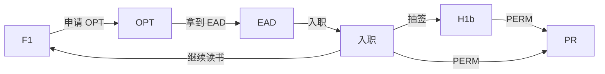

# 签证

F-1

CPT(curriculum practical training)

OPT(Optional Practical Training)

pre-OPT

H1b

NIW

EB1/2

F1 → 申请 OPT → 拿到 EAD → 入职 → 申请 H1b 或继续读书 → H1b 转绿卡

US Green Card Holder (US Lawful Permanent Resident)

1. **非移民签证**：临时访问美国的人员，包括旅游、商务、工作和学习等目的。

   - **B-1/B-2 签证**：

     - B-1 商务。
     - B-2 旅游、探亲或医疗治疗。

   - **F-1 和 M-1 签证**：分别用于学术学生和职业学生。

     - CPT
     - OPT
       - pre-OPT

   - **H-1B 签证**：用于在特定专业职位工作的专业人士。

     雇主 Sponsor，抽签，只能获得雇主的主动收入

     - **名额限制**：H-1B 签证每财政年度有名额上限。
       - 常规名额：65,000
       - 额外名额：20,000 拥有美国高等教育机构学位的申请人。

   - **J-1 签证**：用于交换访问学者、学生、实习生等。

   - **L-1 签证**：用于跨国公司内部调动的员工。

   - **O-1 签证**：用于具有杰出能力的个人，如艺术家、科学家、商业领袖等。

2. **移民签证**：打算永久居住在美国的人员。

   - **亲属移民签证**：美国公民和合法永久居民可以为亲属申请。

   - **就业移民签证**(Employment-Based)：

     基于雇佣的各类别，包括优先工人、专业人士等。

     - EB-1

       - EB-1A

     - **EB-2** 雇主担保移民

       - PERM

         如果发生裁员，则短期内不能办理 perm

         普通 PERM 和 day 1 PERM 类公司就是这一类，如 flag

       - NIW

         不与雇主挂钩

     - EB-3 技术类移民

     - EB-5 投资移民

   - **多样性签证（DV）**：通过随机抽签方式，提供给低移民率国家的人民。

3. **特殊类别签证**：如外交签证（A、G 类）、特定国际组织的员工签证等。

4. **过境/机组人员签证**：

   - C-1 过境签证
   - D-1/D-2 机组人员签证

### F-1

### CPT

[Cornell CPT policy](https://international.globallearning.cornell.edu/employment-and-taxes/f-1-cpt)

- You've been in full-time student status for at least one academic year (two full semesters) before you apply.

### OPT

[cornell OPT policy](https://international.globallearning.cornell.edu/employment-and-taxes/f-1-opt)

Optional Practical Training (OPT) is a benefit and extension of F-1 student status for those who have completed at least two academic semesters in the United States in F-1 status. It lets you apply what you learned in your degree program to off-campus work in your field of study.

You can receive at least 12 months of full-time OPT when you complete a degree program, unless you used some or all of your OPT while still a student. The amount of OPT you used as a student is deducted from the allowable 12 months of post-graduation OPT.

STEM, add 24m

[签证科普](https://www.1point3acres.com/bbs/forum-99-1.html)

---

银行卡

- Debit Card, 借记卡，俗称储蓄卡
- Credit Card, 贷记卡，俗称信用卡

手机卡

- SIM
- e-SIM

---

- T-Mobile
- AT&T
- giffgaff

英国 GiffGaff

---

SSN

A Social Security Number (SSN) is a unique, permanent identification number used for income tax reporting. F-1 students are **not eligible for a social security number** unless they have received a job offer and will be participating in authorized employment on-campus, CPT, or OPT.

需要有 offer 才可以办，比如校内的兼职工作

---

- F-1 签证
- I-20 表格
- I-94 表格（入境记录）

---

准备

手机卡

- T-Mobile

银行卡

- 实体卡

  - MasterCard
  - Visa
  - amex(American Express)

- 虚拟卡
  - [OneKey](https://card.onekey.so)
  - Wise

网络

节点

- [jsss](http://jsss-50.top)
- [2y](https://两元店.com/)

---

F-1

i20

[DS160](https://ceac.state.gov/genniv/)

servis

https://portal.ustraveldocs.com/

[预约面签中文站](https://cgifederal.secure.force.com/)

[预约面签英文站](https://portal.ustraveldocs.com/)

https://mp.weixin.qq.com/s?__biz=MzIyMjA5NjE0NA==&mid=2651524363&idx=1&sn=7d4827d9277c5dad07169dc9c702da45&chksm=f240f01845ef035676b854a12a417a362167c12ab0fe2e10bc2a9e98f00c62184c31aed3193a&scene=27

https://mp.weixin.qq.com/s?__biz=MzkzNzI0OTc3NA==&mid=2247507921&idx=1&sn=56501f9accd91faf8221ad21bfbc7710&chksm=c290c150f5e748461c32bad72ec4679b307e012606d0b53a4c236caedeba9d085fcf7d86498b&scene=27
