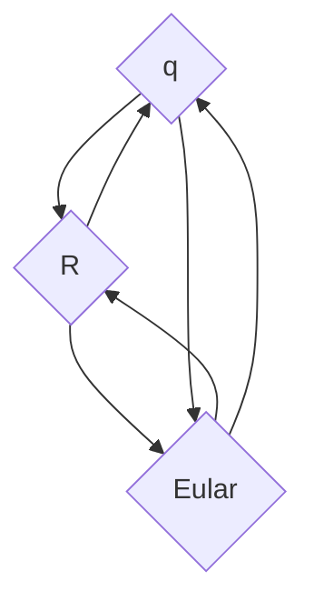

# Coordinate Systems

- Linear Algebra Review
- Vector Spaces
- Coordinate Transformations
- Euler Angles
- Quaternions

## Linear Algebra Review

Coordinate System

- left handed

- right handed

### Notations and Definitions

**Scalar**

**Vector**

- Column vector
- Row vector

Unit Vector

Vector **magnitude**(length)

$||\bar{\phi}||=\sqrt{}$

Matrix 

Matrix transpose

**Dot product**

$\bar{\phi} \cdot \bar{r}$

**angel** between 2 vec

$\theta=cos^{-1}(\frac{\bar{\phi} \cdot \bar{r}}{||\bar{\phi}|| ||\bar{r}||})$

**Projection**

$\hat{u}=\frac{\bar u}{||\bar{u}||}$

$||\phi||\cos \theta\hat u$

### Alignment to target

angle

axis (两个向量形成平面的法向量)

Cross product

## Coordinate Transformations

Frames of Reference 参考系

- translate
- rotate
- Scale

### Pure Rotation

> v1 in Frame 1 to the Frame 0
>

$\bar\phi=\phi_x^1\bar i_1+\phi_y^1\bar j_1+\phi_z^1\bar k_1$

$\bar\phi^0=R_1^0\bar \phi^1$

Rotation Matrix: $R_1^0$

$R_0^1R_1^0=I$

$R_1^0=(R_0^1)^T=(R_0^1)^{-1}\Rightarrow $ Orthonormal Matrix

$$
R_1^0(x,\phi)=R_X=\begin{pmatrix}
1 & 0 & 0 \\
0 & \cos\phi & -\sin\phi \\
0 & \sin\phi & \cos\phi
\end{pmatrix}
$$
绕 \( y \) 轴旋转 \( $\theta$ \) 角度的旋转矩阵可以表示为：
$$
R(y,\theta)=R_Y = \begin{pmatrix}
\cos\theta & 0 & \sin\theta \\
0 & 1 & 0 \\
-\sin\theta & 0 & \cos\theta
\end{pmatrix}
$$
将点 \((x, y, z)\) 旋转到新的位置 \((x', y', z')\) ，其中 \( \theta \) 是绕 \( y \) 轴的旋转角度。
$$
R(z,\psi)=R_Z = \begin{pmatrix}
\cos\psi & -\sin\psi & 0 \\
\sin\psi & \cos\psi & 0 \\
0 & 0 & 1
\end{pmatrix}
$$
#### Euler Angles

roll, pitch, yaw

Phi, theta, Psi

**Order of 3 rotations about local axis**

y -> z -> x

$R_E=R_{zyx}(\phi, \theta,\psi)=R_ZR_YR_X$
$$
\begin{aligned}
R_E
&=R_{ZYX}(\phi,\theta,\psi)\\
&=R_z(\psi)R_Y(\theta)R_X(\phi)\\
&=\begin{pmatrix}
\cos\psi & -\sin\psi & 0 \\
\sin\psi & \cos\psi & 0 \\
0 & 0 & 1
\end{pmatrix}\begin{pmatrix}
\cos\theta & 0 & \sin\theta \\
0 & 1 & 0 \\
-\sin\theta & 0 & \cos\theta
\end{pmatrix}\begin{pmatrix}
1 & 0 & 0 \\
0 & \cos\phi & -\sin\phi \\
0 & \sin\phi & \cos\phi
\end{pmatrix}\\
&=\begin{pmatrix}
\cos\theta\cos\psi & \sin\phi\sin\theta\cos\psi-\cos\phi\sin\psi & \sin\phi\sin\psi+\cos\phi\sin\theta\cos\psi \\
\cos\theta\sin\psi & \sin\phi\sin\theta\sin\psi+\cos\phi\cos\psi & \sin\psi\sin\theta\cos\phi-\cos\psi\sin\phi \\
-\sin\theta & \cos\theta\sin\phi & \cos\theta\cos\phi
\end{pmatrix}
\end{aligned}
$$

### Fixed Angles

**Order of 3 rotations about world axis**

x->y->z

$R_{zyx}=R_zR_yR_x$

### Pure Translation

translation vector: $\vec{d_1^0}$

$\vec {p^0}=\vec {p^1}+\vec {d_1^0}$

### Pure Scale

Scale matrix: $S$
$$
S = \begin{pmatrix}
S_x & 0 & 0 \\
0 & S_y & 0 \\
0 & 0 & S_z
\end{pmatrix}
$$

### Homogeneous Transform

$\vec {p^0}=R_1^0\vec {p^1}+\vec {d_1^0}$
$$
\begin{pmatrix} 
\vec p^0 \\ 
1
\end{pmatrix}=\begin{pmatrix} 
R_1^0 && \vec d_1^0 \\ 
0 && 1
\end{pmatrix}\begin{pmatrix} 
\vec p^1 \\ 
1
\end{pmatrix}=H_1^0\begin{pmatrix} 
\vec p^1 \\ 
1
\end{pmatrix}
$$
homogeneous vector 齐次坐标

homogeneous transform matrix: $H_1^0$

Pure Transformation: 
$$
H_{rot}=H_{rotate}=\begin{pmatrix} R && 0 \\ 0 && 1\end{pmatrix}\\

H_{rot}(axis, angle)=\begin{pmatrix} R_{axis}(angle) && 0 \\ 0 && 1\end{pmatrix}\\

H_{trans}=\begin{pmatrix} I && \vec d \\ 0 && 1\end{pmatrix}\\

H_{scale}=\begin{pmatrix} S && 0 \\ 0 && 1\end{pmatrix}\\

S = \begin{pmatrix}
S_x & 0 & 0 \\
0 & S_y & 0 \\
0 & 0 & S_z
\end{pmatrix}
$$
#### Operations

H matrix multiplication
$$
H_1H_2=\begin{pmatrix}
R_1R_2 && R_1\vec d_2+\vec d_1\\
0 && 1
\end{pmatrix}
$$

H matrix inverse
$$
\begin{align}
H^{-1}&=\begin{pmatrix}
R^T && -R^T\vec d\\
0 && 1
\end{pmatrix}\\
H^{-1}_{rot}&=\begin{pmatrix}
R^T && 0\\
0 && 1
\end{pmatrix}\\
H^{-1}_{trans}&=\begin{pmatrix}
I && -\vec d\\
0 && 1
\end{pmatrix}
\end{align}
$$

Product of inverse => reverse order of individual inverse
$$
H=H_1H_2H_3\\
H^{-1}=(H_1H_2H_3)^{-1}=H_3^{-1}H_2^{-1}H_1^{-1}
$$

## Frames of Reference

Frame of Reference: $F$

Global(World) Frame: $F_0=I$

$F_1=F_1^0=H_1F_0$

$\vec p^0=F_3^0 \vec p^3$

---

- rotated frame to unrotated frame
- Local to global
- body to world
- child to parent

---

sequences of transforms => order of 

- post-multiply=>local axis
- pre-multiply=>global axis

$H=H_3(H_1H_2)H_4$

---

Given p0, compute  p3

Given F1, F2, compute H12
$$
F_2^0=HF_1^0\Rightarrow H=F_2^0(F_1^0)^{-1}\\
F_2^0=F_1^0H\Rightarrow H=(F_1^0)^{-1}F_2^0
$$

### Convert handed

Converting form left handed to right handed Coord System
$$
x^L,y^L,z^L\\
x^R,y^R,z^R\\
x^R=x^L,
y^R=y^L,
z^R=-z^L
$$
Euler Angles
$$
[\phi^L,\theta^L,\psi^L]\\
[-\phi^R,-\theta^R,\psi^R]
$$
## Quaternions

Axis: $\hat u$, Angle: $\theta$
$$
\vec q=\begin{pmatrix}
s\\\vec v
\end{pmatrix}=\begin{pmatrix}
w\\\vec v
\end{pmatrix}=\begin{pmatrix}
\cos\frac{\theta}{2}\\\sin\frac{\theta}{2}\vec u
\end{pmatrix}=
\begin{pmatrix}s\\ v_x\\ v_y\\ v_z\end{pmatrix}
=\begin{pmatrix}w\\ x\\ y\\ z\end{pmatrix}
$$

### Background

Problems of Euler Angles representing rotations

#### axes colinear => "Gimbal lock"

Gimbal locked airplane. When the pitch (green) and yaw (magenta) gimbals become aligned, changes to roll (blue) and yaw apply the same rotation to the airplane.

### Operations

- Add: $\vec q_1+\vec q_2=[s_1+s_2, v_1+v_2]^T$
- Mul: $\vec q_1\cdot\vec q_2=[s_1s_2-\vec v_1\vec v_2, s_1\vec v_2+s_2\vec v_1+\vec v_1\times\vec c_2]^T$
- Mag: $||\vec q||=w^2+x^2+y^2+z^2=1$
- Inv: ${\vec q}^{-1}=(\frac{1}{||\vec q||})^2[s, -\vec v]^T=[s, -\vec v]^T$

### Usage

$$
\vec p_{rot}=\vec q\cdot\vec p\cdot\vec q^{-1}\\
$$

Rotate axis by quaternion q

## Orientation Representation Conversion

**Quiz**

- Rotation Matrix
- Eular Angles
- Quaternions

### Q => R

$$
\hat i_{rot}=\begin{pmatrix}
1-2y^2-2z^2\\
2xy+2wz\\
2xz-2wy
\end{pmatrix}\\
\hat j_{rot}=\begin{pmatrix}
2xy-2wz\\
1-2x^2-2z^2\\
2yz+2wx
\end{pmatrix}\\
\hat k_{rot}=\begin{pmatrix}
2xz+2wy\\
2yz-2wx\\
1-2x^2-2y^2\\
\end{pmatrix}\\
R=[\hat i|\hat j|\hat k]
$$

### R => Q

$$
w=\frac{\sqrt{1+r_{11}+r_{22}+r_{33}}}{2}\\
x=\sqrt\frac{1+r_{11}-2w^2}{2}=\frac{r_{32}-r_{23}}{4w}\\
y=\sqrt\frac{1+r_{22}-2w^2}{2}=\frac{r_{13}-r_{31}}{4w}\\
z=\sqrt\frac{1+r_{33}-2w^2}{2}=\frac{r_{21}-r_{12}}{4w}
$$

### E => Q

$$
\vec q_{xyz}=\vec q_x\vec q_y\vec q_z\\
\vec q_x=[\cos\frac{\phi}{2},\sin\frac{\phi}{2}\hat u]^T=[\cos\frac{\phi}{2},\sin\frac{\phi}{2}(1,0,0)]^T\\
\vec q_y=[\cos\frac{\theta}{2},\sin\frac{\theta}{2}\hat u]^T=[\cos\frac{\phi}{2},\sin\frac{\phi}{2}(0,1,0)]^T\\
\vec q_z=[\cos\frac{\psi}{2},\sin\frac{\psi}{2}\hat u]^T=[\cos\frac{\phi}{2},\sin\frac{\phi}{2}(0,0,1)]^T
$$

### R => E

$$
\phi_y=-\arcsin r_{31} \\
\phi_x = \arctan\frac{r_{32}}{r_{33}}\\
\phi_z = \arctan\frac{r_{21}}{r_{11}}
$$

### E => R

$$
R_{ZYX}=R_ZR_YR_X
$$

