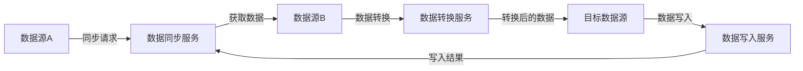
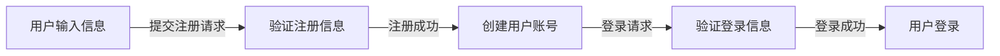
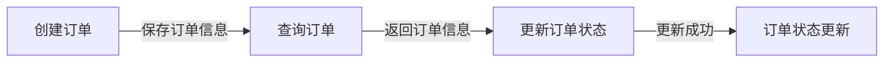
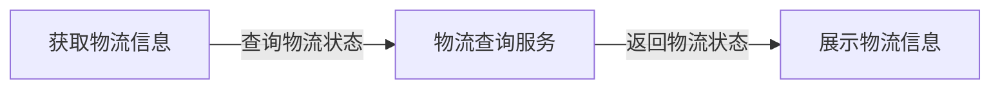
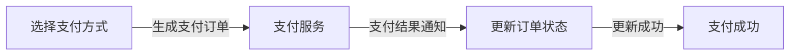
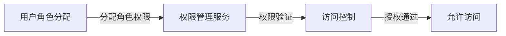
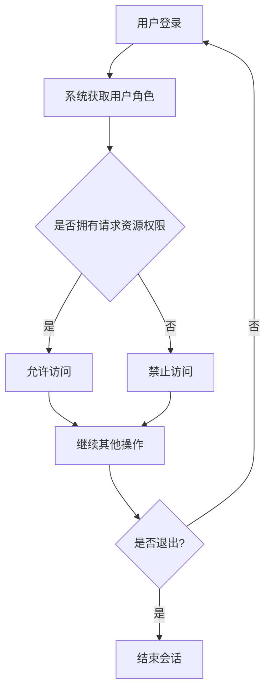

# 实训总结报告

##  “前言”

### “实训背景”

> 可简介实训目的、通过何种方式到此单位实训等内容；

### “实训环境”

> 可包括实训单位全称（中英文）、地址、实训单位性质、规模、简介、所在部门、该部门主要工作、指导教师安排等内容；

### “实训过程”

> 概述实训各阶段所从事的主要工作等。

- 学习阶段

- 分析阶段

- 设计阶段

- 开发阶段

  - 后端：承担整个后端所有的工作。所有接口设计、开发和测试

    本系统按照业务需求设计，分为了10个微服务

    - 权限控制服务
    - 用户服务
    - 购物车服务
    - 商品服务
    - 系统服务
    - 搜索服务
    - 主页服务

  - 前端：

    - 管理端：权限管理、登录注册、商品管理
    - 用户端：首页展示、登录注册、商品搜索、商品详情
    - 配送端：

- 开发阶段

  - 接口测试
  - 联调测试
  - 压力测试

## “实训内容”

部分：属报告的主要部分。

### “概述”

包括：

- 项目介绍、

- 本人从事的工作

  组长、分工协调、进度管理、质量控制

  - 学习阶段

  - 分析阶段

  - 设计阶段

  - 开发阶段

    - 后端：承担整个后端所有的工作。所有接口设计、开发和测试

      本系统按照业务需求设计，分为了10个微服务

      - 权限控制服务
      - 用户服务
      - 购物车服务
      - 商品服务
      - 系统服务
      - 搜索服务
      - 主页服务

    - 前端：

      - 管理端：权限管理、登录注册、商品管理
      - 用户端：首页展示、登录注册、商品搜索、商品详情
      - 配送端：

  - 开发阶段

    - 接口测试
    - 联调测试
    - 压力测试

- 等；

### “相关技术”

包括

- 与项目相关的理论基础，
  - OOD、
  - System Design
  - Design Pattern
  - Design Principal
- 项目开发方法、
  - 
- 开发工具、
  - IDEA
  - Navicat
  - RedisInsight
  - Kibana
  - knife4j
  - VS Code
  - Git
  - husky
  - Warp
- 开发环境
  - Java 1.8
  - MySQL 5.7
  - Redis 6.2.6
  - Elastic Search 7.8.0
  - IK分词器xxx
  - RabbitMQ  3.11.8
  - Vue 3.2
  - Docker 20.10.22
  - CentOS 7.9
  - MacOS 
  - 依赖版本
- 等关键技术的介绍；

### “系统分析”

包括**对整个项目的介绍分析**及**本人工作内容的详细分析**，如

- 业务分析、

  - 重点是什么，要体现什么、写到什么程度，画什么图/表

  - 内容：

    - 提取这个文档的主要功能
    - 分析的过程不需要写，只需要写分析的结果（就是我们需要做哪些业务

  - 比如说文档上写的详细功能下面说的有业务，这里面把他列出来就可以了

    拿文档的提炼一下，再加一些自己的东西

    eg. 库房管理的业务

  - 角色

    客户、客户服务中心、调度中心、配送中心、财务部、区域中心库房、分站、分站库房、运输公司、财务、公司领导、供应商、配送员。

    客户、供应商、配送员、公司领导、系统管理员、运输公司、客户服务中心、调度中心、配送中心、财务部、区域中心库房、分站、分站库房。

- 功能分析（可使用

  - 用例图、（占到用户的角度去画，有哪些功能如登入注册下单查看供应商信息

    展现每个角色能做的东西

  - **活动图**来描述）、（这个也可以画，单子的流转先不需要画，无法这么详细

    流程图是按业务来划分的，按照业务来画的，比如说新订这样的业务（不需要画所有的流程（比如查询之类的），只需要画主要的流程），放到业务分析的过程中，不需要画泳道，在用例图里面就可以画角色（比如配送员能看什么

    不需要并行，就画成一个单线流程的就可以了

- 可行性分析等；

### “系统设计”

“系统设计”包括总体设计和详细设计，

#### 总体设计

包括（这块大家是一致的）

- 系统架构设计、
  - **功能架构图**（思维导图
  - ~~技术架构图（各个微服务、中间件、网管这些）~~
- 功能模块划分等，
  - 就是列一个表简单概述

#### 详细设计

要围绕本人工作内容展开，包括

- 功能模块详细设计、
  - 
- 类和对象的设计、
  - 
- *动态模型设计*
  - 时序图、
  - 状态图、
  - 协作图等）、
- 算法设计、
  - 具体是什么样的算法
  - 随便挑一些写上去就行，比如说如何 ID 不重复，比如说写个一两个
- 数据库设计等；
  - ER图（陈 notation 还是 方框的 notation）
  - 关系模式
  - 表的详细描述

### “系统实现”

> “系统实现”也要围绕本人工作内容展开，从编码实现角度论述相应功能模块的实现细节，并展示自己所完成的主要成果及实际应用情况等。可通过

- “程序流程图”、

  找几个典型的，

- “关键代码”和

  比如哪里用了重要的技术点

- “界面”进行直观论述。

  界面截图

  界面上的一些功能输入、分类排序之类的

- 后端实现

    按照微服务划分part，每个part挑出重点的部分来讲这些如下两种内容

    - “程序流程图”、

      找几个典型的，

    - “关键代码”和

      比如哪里用了重要的技术点，比如说redis、mq、es

- 前端实现

    按照管理端、用户端划分part，

    - 管理端
      - 登录注册
        - 登录
        - 注册
      - 权限管理
      - 商品管理
    - 用户端
      - 首页
      - 登录注册
      - 商品搜索
      - 商品详情
      - 个人中心
      - 信息修改
    
    - “界面”进行直观论述。
    
      界面截图
    
      界面上的一些功能输入、分类排序之类的

### “系统测试”

> “系统测试”包括，
>
> 这块内容也比较多

- 测试方案设计、

  在设计测试方案时，可以考虑以下几个步骤：

  1. 确定测试目标：明确测试的目的和预期结果。例如，测试一个软件的功能是否正常、性能是否满足要求等。

  2. 制定测试计划：根据测试目标，制定详细的测试计划，包括测试的范围、测试的时间安排、测试的资源需求等。

  3. 确定测试用例：根据测试目标，设计测试用例，覆盖各种可能的情况。测试用例应该包括输入数据、预期输出和实际输出的对比。

  4. 准备测试环境：根据测试需求，搭建适当的测试环境，包括硬件设备、操作系统、网络环境等。

  5. 执行测试用例：按照测试计划，执行设计好的测试用例，并记录测试结果。

  6. 分析测试结果：对测试结果进行分析，比较实际输出和预期输出的差异，找出问题所在。

  7. 编写缺陷报告：对于发现的问题，编写详细的缺陷报告，包括问题的描述、复现步骤、影响范围等。

  8. 进行问题跟踪和修复：跟踪缺陷报告的处理过程，确保问题得到及时修复。

  9. 重复测试：对修复后的问题进行再次测试，确保问题已经解决。

  10. 完成测试：根据测试结果和测试目标，评估测试的完成情况，并撰写测试报告。

  以上是一个基本的测试方案设计流程，具体的测试方案设计还需要根据具体的项目和需求进行调整和完善。

  打算怎么测试

  - 接口测试

    路径覆盖，挑重点的写一下，有代表接口

  - 连调测试

    就是前后端页面联调，

  - 压力测试

- 测试用例和

  

- 测试结果、

  

- 最终的测试结论或评价等。

##  “总结”

部分：

### 实训体会

### “其它意见”

可对学院课程设置、教学内容、实训安排等方面提出自己的意见或建议，也可对实训单位的各个方面提出自己的意见。

当撰写项目总结报告的第二个板块“系统实现”时，你可以按照以下思路进行书写：

1. 引言：简要介绍你所参与开发的项目，并提及你在项目中的具体工作职责和角色。

2. 功能模块概述：对项目的主要功能模块进行概述，列出每个模块的名称和功能描述。这可以帮助读者了解整个系统的结构和功能。

3. 编码实现细节：针对你负责的功能模块，从编码实现的角度详细论述相应模块的实现细节。可以按照以下方式进行组织：

   - 程序流程图：使用程序流程图展示你所负责模块的主要流程和逻辑。流程图可以帮助读者更好地理解代码的执行过程。

   - 关键代码：选取你认为最关键、最具代表性的代码片段，并进行解释和说明。可以解释代码的功能、实现思路、使用的算法或数据结构等。

   - 界面展示：如果你负责的模块涉及用户界面，可以通过截图或界面设计图展示你所完成的界面。并对界面的设计原则、交互方式等进行说明。

4. 主要成果和实际应用情况：列举你在项目中所完成的主要成果，例如功能的实现、Bug修复、性能优化等。同时，描述这些成果在实际应用中的表现和效果，以及对用户体验和系统性能的影响。

5. 总结：对你在系统实现过程中遇到的挑战、解决方案和经验进行总结。可以提及你在编码实现中学到的技术或知识，以及对未来类似项目的启示。

提纲示例：

1. 引言
   - 项目介绍
   - 工作职责和角色

2. 功能模块概述
   - 模块A：功能描述
   - 模块B：功能描述
   - ...

3. 编码实现细节
   - 模块A
     - 程序流程图
     - 关键代码解释
     - 界面展示（如果适用）
   - 模块B
     - 程序流程图
     - 关键代码解释
     - 界面展示（如果适用）
   - ...

4. 主要成果和实际应用情况
   - 模块A：主要成果和应用情况
   - 模块B：主要成果和应用情况
   - ...

5. 总结

请根据你实际的项目情况和工作内容，调整提纲中的模块和细节。

在一个前后端分离的、微服务的物流管理系统中，你可以选择画以下部分的程序流程图：

1. 用户注册和登录流程：画出用户注册和登录的流程，包括用户输入信息、验证、数据库操作等步骤。

2. 订单管理流程：画出订单管理的流程，包括创建订单、查询订单、更新订单状态等步骤。

3. 物流跟踪流程：画出物流跟踪的流程，包括物流信息的获取、更新、展示等步骤。

4. 支付流程：画出支付的流程，包括用户选择支付方式、生成支付订单、支付结果通知等步骤。

5. 用户权限管理流程：画出用户权限管理的流程，包括用户角色分配、权限验证、访问控制等步骤。

6. 数据同步流程：如果系统中有多个微服务，可以画出数据同步的流程，包括数据的传输、同步、更新等步骤。

这些是物流管理系统中一些常见的功能模块，你可以根据你的实际项目需求和工作内容，选择适合的部分进行程序流程图的绘制。程序流程图可以使用工具如Visio、Lucidchart、Draw.io等进行绘制，或者手动绘制流程图。

在绘制程序流程图时，可以使用流程图的常用符号和图形，如开始/结束符号、流程框、判断条件、箭头等，来表示不同的步骤和流程。确保流程图的逻辑清晰、易于理解，并与实际代码实现相符合。

希望这些信息能帮助你绘制物流管理系统中的程序流程图！如果你有任何其他问题，请随时提问。

当使用Mermaid代码绘制程序流程图时，以下是你提到的几个示例的Mermaid代码：

1. 用户注册和登录流程：

2. 订单管理流程：

3. 物流跟踪流程：

4. 支付流程：

5. 用户权限管理流程：

6. 数据同步流程：

将上述Mermaid代码放入Markdown文档中，使用Mermaid插件或在线Mermaid编辑器，即可生成对应的程序流程图。

希望这些Mermaid代码能帮助你绘制程序流程图！如果你有任何其他问题，请随时提问。

