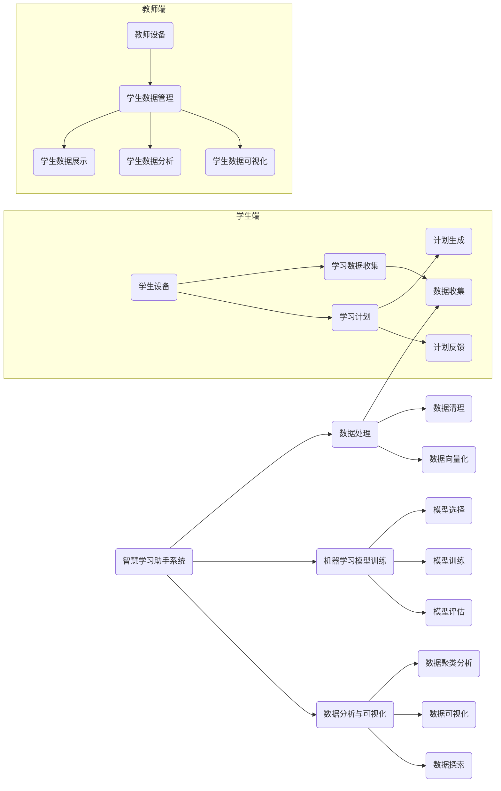

# 期末

基本上都是原题

25 道客观题小题，每个人的不同，有的题 1 分，有的 2 分：选择、判断

- Multisim
- Matlab
  - 矩阵
  - 图像

## 小题

### 一

### 1

### 2

总之，光电三极管工作原理分为两个过程：一是 **光电转换；二是光电流放大**。最大特点是输出电流大，达毫安级。 但响应速度比光电二极管慢得多，温度效应也比光电二极管大得多。

### 3

( )是指光照在半导体中激发出的光电子和空穴在空间分开而产生电位差的现象,是将光能变为电能的一种效应。

### 4

单向导电

### 5

温度升高后，本征半导体内自由电子和空穴数目都增多，且增量相等。（原题）

对

### 6

对

### 二

#### 2

**光电导效应**是指物体在入射光能量的激发下，其内部产生光生载流子(电子 -空穴 对)，使物体中载流子数量显著增加而电阻减小 …

### 五

在二值图像中，像素只有 0 和 1 两种取值，一般用 0 来表示黑色。

## 大题

1 道主观题 4.0 分

说明一种你设计的智能化教学系统的概念性设计

需求：图文并茂，200-250 字，Word 文件，命名方式：

旨在为学生和教师提供更高效和个性化的教学体验。系统将基于学生的个人学习风格和兴趣，提供个性化的学习计划和资源，同时通过多种方式为教师提供教学支持和反馈。

一个智能学习管理系统，本系统会收集学生的学习数据，如学习速度、答题准确度、知识点掌握程度等，通过分析学生的数据，为学生提供最适合他们的学习计划。此外，该系统还会提供一些有趣的学习资源，如在线教程、互动式练习、多媒体资料等，以吸引学生的注意力，促进他们的学习。

教师可以通过系统查看学生的学习进度和数据，以及为学生提供反馈和指导。同时，系统也会提供一些智能化的辅助工具，如题库、自动批改等，以减轻教师的工作压力。

系统还包括在线课程、讨论论坛模块。在线课程将为学生提供一些全新的课程内容和学习体验，而讨论论坛则是一个互动和合作的学习社区，学生和教师可以在这里分享知识、讨论问题和解决难题。

