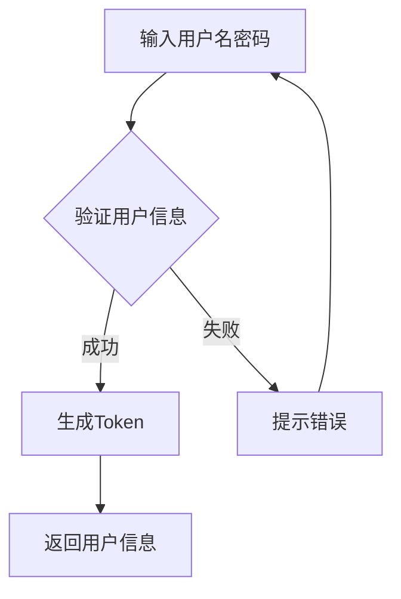
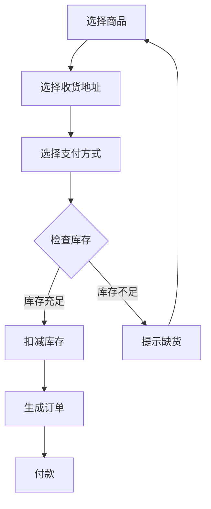

# 前端设计

## 界面设计

- 用户和骑手优先保证移动端的界面，vant
- 管理界面只需要电脑端，arco design

### 用户端

#### 登录注册（刘）

-  登录
  - 账号密码登录
  - 邮箱登录
-  注册
   -  邮箱注册

#### 订单管理/我的订单

- 下单（deng）
- 所有订单，查看已有的所有，这里可以（**雷神**）
  - 搜索
  - 无限下拉，分页
- 订单详情（**雷神**）
  - 订单信息（收货地址、收货人、发送时间、预计达到时间
  - 订单状态
  - 地图（假的，现实再那个城市）

#### 购物管理（冷）

- 购物车管理
  - 增加/删除/查商品入购物车
  - 修改数量
- 商品收藏，可以不做
  - 增删改查

#### 地址管理（deng）

- 地址的增删改查
- 设为默认

#### 账户管理（刘）

- 修改头像
- 修改资料
- 修改密码

#### 首页（刘大维）

- 上面广告
- 下面推荐商品列表
- 首页商品分类

#### 商品（刘大维）

- 商品搜索
- 商品详情

#### 分类（冷）

获取所有商品分类

#### 搜索（刘大维）

根据什么排序，名称、类别

### 配送端

- 通知
  - 到货通知
  - 退货通知
  - 催件通知
- 我的任务单（yu）

### 管理端

按角色有不同

- 调度管理员
  
  - 操作
  
    - 送货
      - 手动调度：订单
  
    - 退货
      - 手动调度：订单
  
  - 页面
  
    - 订单列表
  
      - 手动调度，在商品详情页面里面，已支付和已调度
        - 修改分站
        - 修改物流公司
        - 修改订单地址
  
    - 库房商品查询
  
      - 商品库存列表，SKU_WARE
  
        区域库房名称搜索框
  
    - 调拨单管理
  
      调拨单的查看
  
- 系统管理员
  - 区域中心库房crud
  - 权限管理
    - 角色
    - 权限

- 分站管理员

  - 操作

    - 送货
      - 入库：分发单
      - 分配：给配送员派任务
      - 打印：任务单（已分配的任务单）
      - 录入：回执任务单

    - 退货
      - 退货入站
      - 退货退回

  - 页面

    - 任务单管理，分配、打印、回执录入
    - 配送员列表
    - 分发单列表，入库放这
    - 库存单列表，
    - 签收单列表
    - 调拨单管理，退货退回

  - 有订单列表，
    - 安排配送员
    - 退货确认xx

- 库房管理员（区域中心库房）
  - 补货
  - 运输公司

  - 操作

    - 购货
      - 入库：购货单入库	
    - 送货
      - 出库：调拨单
      - 打印：分发单

    - 退货
      - 退货入库

  - 页面

    - 运输公司管理，crud
    - 分发单管理，退货入库、打印
    - 库存单管理：打印
    - 调拨单管理：出库
    - 购货单管理：购货入库
    - 分站管理：crud下属分站库房
    - 库存管理：相对于手动补货
  
- 商品管理员

  - 页面

    - 商品分类管理

      - CRUD

        C、U涉及到图片上传

    - 平台属性管理

      attr_group，attr

      - CRUD
      - 详情：看到这个平台属性的所有属性

    - 商品管理

      商品的新建：C基本信息、平台属性、商品图片、商品海报

- 进货管理员

  - 操作

    - 退货供应商
    - 进货供应商

  - 页面

    - 供应商管理

      crud

    - 进货管理

      做成分步表单/或都是下拉搜索框：选择库房、选择商品、选择数量

    - 退货管理 

      退货给供应商，

      商品库存列表，SKU_WARE，点击退货，选择退的数量

- 库房管理员

  - 操作

  - 页面

    - 区域管理

      - 区域管理
      - 区域与库房关联

    - 中心库房管理

      CRUD

      详情：

      - 弹出 modal 库房储备设置

        SKU_WARE 列表

      - 改库房名字、库房的管理员

    - 分站库房管理

      CRUD

    - 出入库/库存单查询

      库存单的列表，只能查询

- 统计分析

  - 页面
    - 订购排行榜，各个商品订购、退货、好评情况，可以按月按时间统计
    - 分站配送情况、
    - 客户满意度分析
    - 财务分析

- 财务管理员

  页面

  - 缴费查询：
  - 发票管理：（未领用、领用、）作废
  - 供应商结算：
  - 配送员工作量管理
  - 可视化
    - 缴费查询：
    - 配送员工作量管理

- 配送管理员

  - 操作

    - 购货
      - 入库：购货单入库	
    - 送货
      - 出库：调拨单
      - 打印：分发单

    - 退货
      - 退货给供应商

  - 页面

    - 进货管理

      - 供应商管理

      - 进货管理

        做成分步表单/或都是下拉搜索框：选择库房、选择商品、选择数量

      - 

  - 退货

  - 商品上架/之类的crud

    - 

  - 供应商管理

    - 

#### 用户管理

#### 权限管理

调度中心人工介入

#### 数据统计

- 人员管理员
  - 权限
  - 会员统计
  - 工作量统计

- 调度管理员
  - 运输公司
  - 分站

- 商品管理员
  - 商品统计

- 库房管理员
  - 中心库房
  - 分站库房

- 中心库房
  - 库存量变动

- 分站管理
  - 工作量统计
  - 各种单的统计

- 财务
  - 发票
  - 订单统计

## 分工

- 增改（分页查询）
  - 
- 删查
  - 
- 接口定义连调
- 数据可视化
- 移动端

单

- 分发单
- 购货单
- 调拨单
- 配送单

