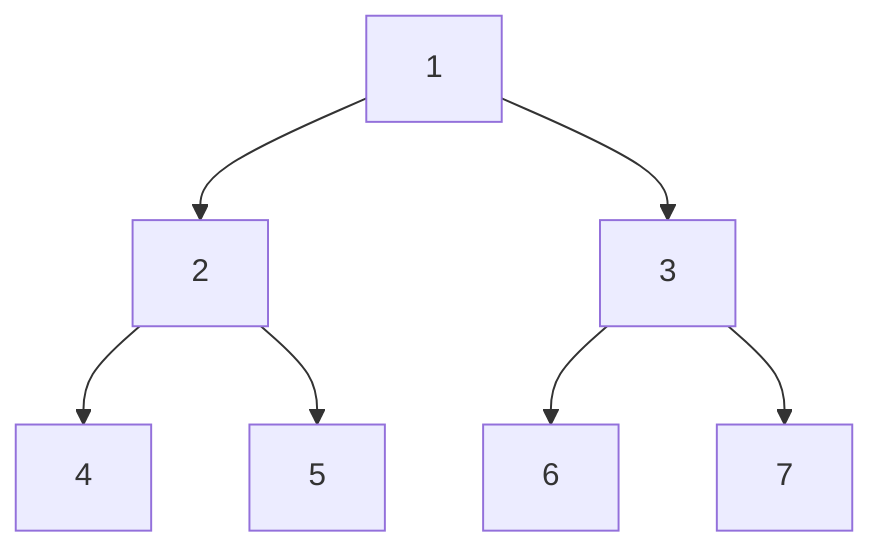

# 测验2


### 选择题


### 论述题

> 从访问控制的角度可将区块链分成几类,分别是什么?并对比各类。

从访问控制的角度，我们常把区块链分为公有链、联盟链和私有链：

- 公有链(Public Blockchain)，是指所有人都可以参与的区块链，比如Bitcoin、EOS、Ethereum。
- 联盟链(Consortium Blockchair)是指只有特定组织或个人可以参与的区块链，比如联合银行间清算系统（UBS）联盟链、Fabric、R3联盟。
- 私有链(Private Blockchain)是指只有特定组织或个人可以参与的区块链，比如Multichain、Monax。

公链和联盟链都是基于共识机制来实现访问控制的，而私链则是基于身份认证来实现访问控制的。公链和联盟链都是去中心化的，而私链则类似于中心化的。

公开区块链是完全开放的，任何人都可以参与其中，故公开区块链的安全性和可靠性可能存在风险。联盟区块链需要授权才能加入，这意味着它具有更高的安全性和效率。

公链和联盟链都具有开放性和透明性，而私链则具有保密性和隐私性。公链和联盟链都具有高度安全性，而私链则需要更严格的身份验证和授权。

在实际应用中，如上三种类型的区块链都有各自适用的场景，可以根据需求进行选择，以满足不同的安全性、隐私性、透明性的需求。


总体来说，公链适用于需要高度安全性、开放性和透明性的场景；联盟链适用于需要高度安全性、开放性、透明性和一定程度上保密性和隐私性的场景；私链适用于需要更高安全性、保密性和隐私性的场景。


三种区块链之间的主要区别在于其访问控制模型。公开区块链是完全开放的，任何人都可以参与其中，这使得公开区块链的安全性和可靠性受到挑战。联盟区块链需要授权才能加入，这意味着它具有更高的安全性和效率。而私有区块链则需要更严格的身份验证和授权，以确保仅有授权的用户才能访问和执行交易。在实际应用中，不同类型的区块链可以根据需要进行选择，以满足不同的安全和隐私需求。


从访问控制的角度，可以将区块链分为以下三类：

公开区块链(Public Blockchain)：公开区块链是一种完全开放的区块链，任何人都可以参与并验证交易，且所有交易数据都是公开可见的。公开区块链通常没有中心化的管理机构，参与者可以匿名地参与，但是需要解决如何防止恶意节点攻击的问题。比如比特币和以太坊的主网就是公开区块链。

联盟区块链(Consortium Blockchair):联盟区块链是由多个组织共同维护的区块链网络。这些组织可以是政府机构、企业、银行等，都需要被邀请才能参与到该网络中。联盟区块链具有更高的安全性和效率，因为节点都是由可信任的实体控制的，且只有授权的节点才验证交易。Hyperledger Fabric和R3 Cordai都是联盟区块链平台。

私有区块链(Private Blockchain):私有区块链是由单一组织或个人维护的区块链网络，参与者需要获得授权才能参与交易和验证。私有区块链可以提供更高的隐私性和安全性，但缺乏去中心化和公开透明的特点。私有区块链通常用于企业内部的管理和数据共享。例如，JP Morgan Chase的Quorum就是一种基于以太坊的私有区块链平台。

三种区块链之间的主要区别在于其访问控制模型。公开区块链是完全开放的，任何人都可以参与其中，这使得公开区块链的安全性和可靠性受到挑战。联盟区块链需要授权才能加入，这意味着它具有更高的安全性和效率。而私有区块链则需要更严格的身份验证和授权，以确保仅有授权的用户才能访问和执行交易。在实际应用中，不同类型的区块链可以根据需要进行选择，以满足不同的安全和隐私需求。

>Bitcoin中交易的Script脚本验证的原理，并举例两种交易验证类型。

Bitcoin中的Script是一种用于验证交易的脚本语言。每个交易都包含输入和输出，输入需要经过验证才能使用，而输出需要满足一定的条件才能被花费。 其中脚本验证的原理是，比特币交易中的输入和输出都包含一个脚本，该脚本是用比特币脚本语言编写的。当一个交易被广播到比特币网络时，每个节点都会验证这个交易是否合法。验证过程需要计算签名脚本和公钥脚本。

举例两种交易验证类型：

- Pay-to-Public-Key-Hash(P2PKH)：在这种类型的交易中，输出脚本直接给出了收款人的公钥哈希值，输入脚本提供了用私钥对整个交易的签名，最后通过OP_CHECKSIG验证。对于一个P2PKH的交易，支出地址的公钥脚本是如下格式： OP_DUP_OP_HASH160 \<PubkeyHash\> OP_EQUALVERIFY OP_CHECKSIG。其中，PubkeyHash是支出地址的公钥的哈希值。签名脚本是由发送者提供的，它包含了发送者的签名和公钥。验证过程就是将签名脚本和公钥脚本合并后执行，如果执行结果为真，则说明这个交易是合法的。
- Pay-to-Script-Hash(P2SH)：P2SH允许用户将一个脚本哈希值作为锁定脚本，而不是直接使用脚本。这使得锁定脚本更加灵活，并且可以支持更多类型的交易验证。P2SH交易需要提供一个解锁脚本，该脚本满足哈希值对应的原始脚本中的条件。如果解锁脚本成功地验证了原始脚本，则该交易被认为是有效的。


> 比特币的发币是有上限的，请陈述原因并给出计算过程第一个四年美挖出一块奖励50btc,每四年减半。[已知四年可生成210000区块]

比特币的发币有上限的原因：

- 目的上：通过限制比特币的供应量来保特比特币的价值稳定，避免通货彭胀。
- 原理上：由于比特币挖出区块的奖励每四年减半，根据该无穷级数的性质，最终产出会收敛到一个定值。

根据比特币协议规定，每四年减半一次（即210000个区块），比特币的挖矿奖励就会减半。第一个四年，每个挖出区块的矿工可以获得50个比特币的奖励，第二个四年（即210000个区块)，每区块奖励减半为25个比特币，经过第三个四年，每区块奖励减半为12.5个比特币，以此类推，直到每区块奖励的比特币数趋近于0。

发行总量计算方法如下：

$210000\times50\times(1+\frac{1}{2}+\frac{1}{2^2}+\frac{1}{2^3}+...)=210000\times50\times\frac{1}{1-\frac{1}{2}}=21000000$

故比特币的总发行量为约2100万枚。

> 给定集合A={8, 10, 2, 4, 9，13, 12,1}, 首先构建Merkle tree，并证明元素5不属于集合A，给出关键路径（证据）。 

首先，将集合元素进行排序得：1 2 4 8 9 10 12 13，再对元素和树中节点做映射：n0对应15、n1对应14，以此类推，构建Merkle tree如下图（见附件中图）


要证明元素5不属于集合A，即需要证明4和8存在于集合A，且在4和8相邻。

1. 在树中，4存在的证据如下：{12, 7, 2}这三个节点，转化为根据每次除2的余数得到二进制数101

2. 在树中，8存在的证据如下：{13, 7, 2}这三个节点，转化为根据每次除2的余数得到二进制数100

3. 1，2已经分别证出4和8存在，又因为他们路径对应的二进制数101和100相差1，故可以证明他们两个数相邻。

综上，根据1，2，3三点可以证出5不存在于集合A。


### 考点1

给定一个集合，让构建一个merkle tree，试证明3属于这个集合


Eg.

$A=\{3,9,6,8,5,10,2,13\}$

构建一棵merkle tree，试证明$3\in A$

（试证者有整棵树的信息，验证者只有根节点的hash值）

这个树怎么用数组存，完全二叉树

节点




x, 从1开始记录

左右儿子：2x, 2x+1


要找兄弟的话，根据奇偶性来判断


The response is from the web search results.

满二叉树是一种特殊的二叉树，它的每一层的结点数都达到最大值，也就是说，深度为k的满二叉树有 (2^k)-1个结点¹。满二叉树可以用数组来存储，因为它没有空缺的结点。数组存储满二叉树的方法是：将根节点存放在下标为1的位置，然后按照从上到下、从左到右的顺序依次存放其他结点。这样，对于任意一个下标为i的结点，它的左子节点在下标为2i的位置，它的右子节点在下标为2i+1的位置，它的父节点在下标为i/2（向下取整）的位置。

余数0证据找左子树，余数1证据找右子树

```java
class MerkleTree {
    int[] merkle;
    int N;
    public MerkleTree(int nums) {
        
    }
    
}
```


```java
public class SimpleMerkleTree {
    public static class Node {
        private final Node left;
        private final Node right;
        private final byte[] value;

        public Node(final Node left, final Node right, final byte[] value) {
            this.left = left;
            this.right = right;
            this.value = value;
        }

        public Node getLeft() {
            return left;
        }

        public Node getRight() {
            return right;
        }

        public byte[] getValue() {
            return Arrays.copyOf(value, value.length);
        }

        @Override
        public boolean equals(Object o) {
            if (this == o) return true;
            if (o == null || getClass() != o.getClass()) return false;
            Node node = (Node) o;
            return Objects.equals(left, node.left) && Objects.equals(right, node.right) && Arrays.equals(value, node.value);
        }

        @Override
        public int hashCode() {
            int result = Objects.hash(left, right);
            result = 31 * result + Arrays.hashCode(value);
            return result;
        }
    }

    private final Node root;

    public SimpleMerkleTree(final Function<byte[], byte[]> hashFunction, final byte[][] values) {
        if (0 == values.length) {
            throw new IllegalArgumentException("Must specify at least one value");
        }

        List<Node> currentLevel = Stream.of(values)
                .map(hashFunction)
                .map(hash -> new Node(null, null, hash))
                .collect(Collectors.toList());

        while (1 < currentLevel.size()) {
            final List<Node> nextLevel = new ArrayList<>();

            for (int nodeIndex = 0; nodeIndex < currentLevel.size(); nodeIndex += 2) {
                final Node firstNode = currentLevel.get(nodeIndex);

                if (currentLevel.size() - 1 == nodeIndex) {
                    nextLevel.add(new Node(firstNode, null, firstNode.value));
                } else {
                    final Node secondNode = currentLevel.get(1 + nodeIndex);

                    nextLevel.add(
                            new Node(
                                    firstNode,
                                    secondNode,
                                    hashFunction.apply(concatenate(firstNode.value, secondNode.value))
                            )
                    );
                }
            }

            currentLevel = nextLevel;
        }

        this.root = currentLevel.get(0);
    }

    public Node getRoot() {
        return root;
    }

    private static byte[] concatenate(final byte[] first, final byte[] second) {
        final int firstLength = first.length;
        final int secondLength = second.length;
        final byte[] concatenated = new byte[firstLength + secondLength];
        System.arraycopy(first, 0, concatenated, 0, firstLength);
        System.arraycopy(second, 0, concatenated, firstLength, secondLength);

        return concatenated;
    }

    @Override
    public boolean equals(Object o) {
        if (this == o) return true;
        if (o == null || getClass() != o.getClass()) return false;
        SimpleMerkleTree that = (SimpleMerkleTree) o;
        return Objects.equals(root, that.root);
    }

    @Override
    public int hashCode() {
        return Objects.hash(root);
    }
}
```


叶子结点的原编号的求法：

每次除2的余数，组成的二进制数，就是他原本的编号

