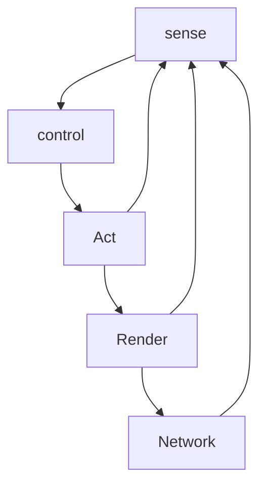

# Behavior Animation

## Steering Behaviors

Agent/Vehicle Dynamics

Individual

- Seek/Flee
- Pursuit/Evasion
- Offset Pursuit
- Arrival/Departure
- Obstacle Avoidance
- Wander

Group Behavior

- Primitives

  - Separation
  - Align
  - Coherence
- Behaviors
- Flocking
  - Follow Leader

> Final:: ask what to use to produce the results

## Sense Control Act Loop

Sense control act simulation paradigm

- Sense
- Control
- Act
- Render
- Network

### Seek/Flee Behavior

Pursuit/Evasion Behavior

Target Predictor - Velocity

Evade

Avoidance Steering behavior

---

Collision Avoidance

Detect potential collision as follows:

$d^0=p^0_{obstacle}-p^0$

Normal Velocity Field

Wander Steer: random change it's direction 

Add Random Velocity vector

Wander: noise generator

### Collision Avoidance

Ray Cast

Multi Ray Cast

Path Following Steering bahavior

Vector field

## Behavior Blending and Arbitration Schemes

Alignment

Separation Behavior

Cohesion

Queueing Steering Behavior

Fixed Priority

For example, 

Neural Net

## Coordinated Movement

Emergent formations

2 level formations

- 

breadth first: ensure shortest but exhausted

best first: do not ensure shortest but fast