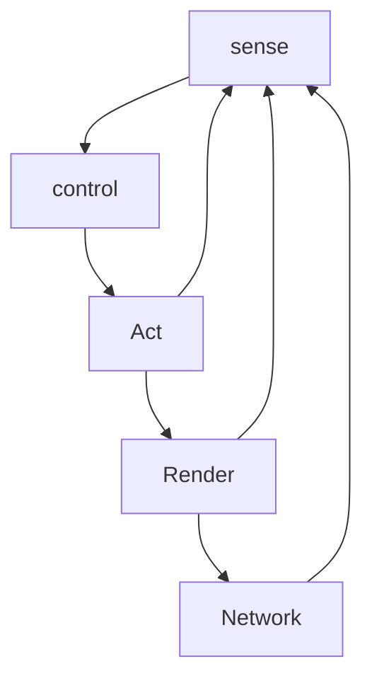

# Feedback Control

Center of mass

Apply a t

Translation: $\dot v=\frac{1}{m}f$

Rotation: $\dot \omega=I^{-1}(\tau-\omega\times I\omega)$

$\ddot\theta=\frac{1}{I_{yy}}\tau$

$\theta_d=$ desired heading angle

like mass-spring damper system (virtual spring, virtual damper)

$\ddot\theta+a_1\dot\theta+a_0\theta=a_0\theta_d$

feedback controller

$\tau=$

$f=$

$\tau=I_{yy}(a_0\theta_d-a_1\dot\theta-a_0\theta)$

$\ddot\theta+2\zeta\omega_n\dot\theta+(\omega_n)^2\theta=(\omega_n)^2\theta_d$

$t_c=\frac{1}{\zeta\omega_n}$

$t_{settle}=4t_c$

which is how long it takes to get to steady state

## Rotation Controller

Given system of this form:

$\ddot \theta+10\theta\dot\theta+2(\dot\theta)^2+2z\theta=b\tau$

how would you make it respond like a system of the form

$\ddot \theta+a_1\dot\theta+a_0\theta=a_0\theta_d$

step1: clean house(leave $\ddot \theta$ alone)

$\tau=\frac{1}{b}(10\theta\dot\theta+2(\theta)^2+2z\theta)+\frac{1}{b}(a_0\theta_d-a_1\dot\theta-a_0\theta)$

## Velocity Controller Design

Given Actual Dynamics: 

$m\ddot z+c\dot z+kz=f$

Want desired 1st order dynamicsL $V_d=$ desired velocity 

$\dot v+aV=aV_d$

choosing $f=-K_pz-K_vV+K_1V_d=kz+(c-ma)v+mav_d$

## Tracking Controller Design

Given: $m\ddot z+c\dot zxxxx$

Want $e=(z-z_d)\Rightarrow0;\dot e=1;\ddot e=0$

With desired Dynamics

## Steering Behaviors

Agent/Vehicle Dynamics

## Sense Control Act Loop

Sense control act simulation paradigm

- Sense
- Control
- Act
- Render
- Network

### Seek/Flee Behavior

Pursuit/Evasion Behavior

Target Predictor - Velocity

Evade

Avoidance Steering behavior

---

Collision Avoidance

Detect potential collision as follows:

$d^0=p^0_{obstacle}-p^0$

Normal Velocity Field

Wander Steer: random change it's direction 

Add Random Velocity vector
