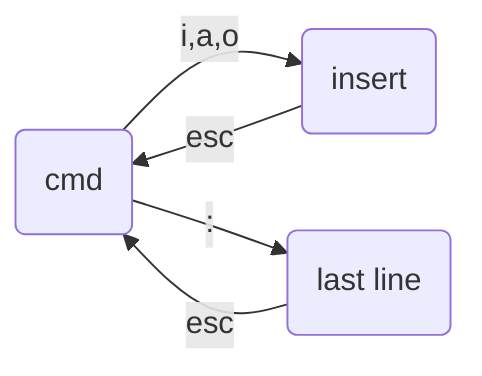

# VI

> 教材 _vimtutor_

## 状态

初始是 cmd 模式

- cmd

  命令模式

  浏览：`j`, `k` 上下调光标

  检索：`/`，并输入搜索内容（支持正则表达式）、回车，就可以看到结果，按 `n` 下一个，`N` 上一个

- insert

  编辑模式

  输入 `i`(或者 `a,o`)，进入编辑模式

- Last line

  末行模式

  输入`:`

  - `:w`
  - `:q`
  - `:wq`
  - `:q!`

### CMD

> 数字通常代表重复做几次的意思

#### 浏览

`j`, 上

`k`, 光标移动下一行

`<enter>`: 光标下移动一行，并且页面下移动一行

`h`, 左

`l`, `<space>`, 右

> 多行移动
>
> - `[n][jkhi]` 向某方向移动 n 行/列
> - `[n]<space>` 向右 n 列
> - `[n]<enter>` 向下 n 行

`<ctl>f`, 下一页

`<ctl>b`, 上一页

`<ctl>d`, 下半页

`<ctl>u`, 上半页

`G`: 移动到文件尾

`[n]G`, `[n]gg`: 移动到第 n 行

`gg`, `1G`: 到文件首

`0`, `^`: 移动到行首

`$`: 移动到行尾

`w`: 下一个单词开头

`b`: 上一个单词开头

`d[0$wb]`: 删除行内 xxx

`y[0$wb]`: 复制行内 xxx

`d1G`

`dG`

`y1G`

`yG`

`V`: 选择当前行，可以加行切换，如 G，10G 等，选中这些行，可以复制剪切删除等

### 检索

`/`：搜索

#### 编辑

`yy`: 复制所在一行

`[n]yy`: 复制所在及向下共 n 行

`dd`: 剪切

`[n]dd`: 剪切所在及向下共 n 行

`p`: 粘贴到光标的下一行

`P`: 粘贴到光标的上一行

`u`：undo，取消上一个指令

`<ctl>r`: 重做上一步

`.`: 重复执行上一个指令

`x`：**删除光标处的字符**

`X`: 删除光标前一个字符

`[n]x`: 删除光标及以后 n 个字符

`J`：和下一行连接在一起（中间加空格）

### Last line

`q!`: 可以不存储就退出

`wq`: 保存并推出

`w`: 保存

`w <文件名>`: 另存为

vim 中的替换

对于替换当前打开文件中的文本，vim 提供如下语法：

`:{作用范围}s/{目标字符}/{替换的字符}/{替换标志}`

作用范围：用于指定替换的范围

- 不写就是当前行
- .,+n 表示替换当前行至下 n 行
- 1,n 表示替换第一行至第 n 行，
- 1,$ 表示替换第一行到最后一行，也可以直接用%表示。

替换标志（可以组合使用）：

- c: confirm，每次替换前都会询问
- e：不显示 error
- g: globe，不询问，整个替换
- i: ignore，即不区分大小写
