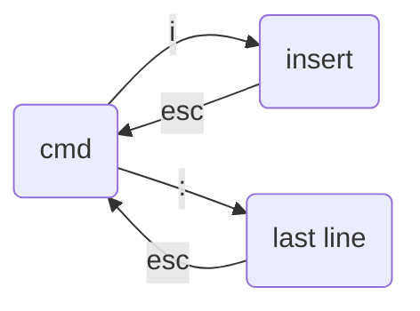

# VI

vi编辑器里面，输入/然后加入搜索内容，然后回车，就可以看到结果，按n可以往后看别的匹配的，shift+n可以往前看

一开始是cmd模式

输入i(或者a,o)，进入编辑模式

### 状态

- cmd

  命令模式

  如：j, k上下调光标

- insert

  编辑模式

- Last line

  末行模式
  
  :
  
  - `:w`
  - `:q`
  - `:wq`
  - `:q!`

### CMD

`j`, 

`k` 上下

`gg` 到文件首

`shift+gg`, a到文件尾

`dd`, 剪切、P粘贴

`0`, shift 6行首

`$`, shift 4行尾

`^`: 

`/`：搜索

`u`：undo

`x`：**删除光标处的内容**

`J`：和下一行连接在一起（中间加空格）

教材vimtutor

### Last line

q!可以不存储就退出

wq

