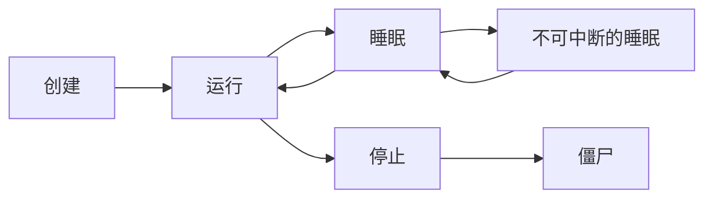
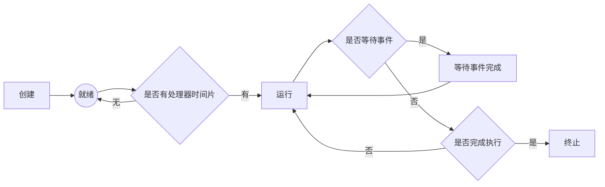
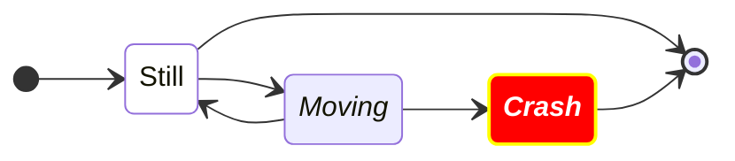

# 6. 进程控制

fork 复制当前进程，状态和 pc 也完全一样，执行 fork 后面部分的程序

换代码、execute 操作

Linux 里面子进程的创建，不会创建

cow 写时复制

redis 持久化：fork 下来复制，然后主线程的修改，写时复制

## 进程死亡的方式

- 自行死亡

  执行完毕，如，c 的 main 函数，返回值是进程返回值，返回给父进程看

- 被杀死

  kill，软中断

  kill -l 可以看到所有的信号，谁杀的、怎么死的

  kill -9 xxx

- 出错没了，call down

## 多进程编程

fork 的返回值是子进程的 pid，-1 说明创建失败

wait()可以等待子进程回来，也可以看看子进程怎么没的，而且还可以给子进程收尸

wait 低 7 位是 signumber，高 8 位是

父进程不看子进程的 return value （wait）的返回，

内存泄漏，不可避免，

中断处理函数

sigkill 和 sig

## 信号

Ctrl c 2 号

Ctrl z 挂起进程，然后再杀死

ps：process status

> -l long
>
> UID，哪个用户运行的
>
> PID，进程号
>
> PPID，父进程号
>
> S，进程状态
>
> - S：sleep，进程挂起
> - R：running，正在运行
> - Z：zombie。子进程死了，父进程不看，就会变成僵尸，只保留一个死的状态；有多种解决方案
>
> PRI：优先级，小的优先级高，不能直接修改
>
> NI：nice number，只能变大不能变小（只有 root 可以用），[-20, 19]，会加到原来的 PRI 上

&符号可以让进程在后台运行

killall 可以根据命令名去杀所有的这个命令带出来的进程

ps -el 传统 UNIX 风格，可以看到所有的前台后台的进程

ps -l，可以看到当前 shell 下面的进程

ps aux, a 表示所有的，u 表示 user，x 表示所有的进程

top

swap 磁盘空间，内存管理里面的会提

uptime，可以嵌入到脚本里面

strace，观察一个进程进行的所有的系统调用，来看他在做什么，需要了解各种 system call

lsof，list open file

> Lsof -u uid 看用户打开的文件
>
> Lsof -p pid 看进程打开的文件

指令

- `ps -el，`

- `strace`，看一个进程的所有的系统调用、对信号非常清楚

  如果对系统调用不熟悉，可以用 man 2 看系统调用

- `lsof`

如果父进程被杀死了，他的子进程会变成孤儿进程，PID 变成 1（init 1 或者 systemd）

动态链接库

.so 的东西都是动态联机库（Windows 下又 dll）

动态链接：库不要放在程序里面，防止程序太大

如果别人 load 过了，就在内存里面直接使用（叫做动态链接）

生僻库编译的时候建议用静态链接，

根目录下别碰，usr 下随便弄，安装也安装在 usr 下最好

现在新的红帽下，根目录下的文件都是符号链接到 usr 下的了

动态链接放到 usr/bin 里面就可以了

redis epoll，fork 持久化

redis in action（redis 实战）

CPU 饱和（burst）没事，性能线性下降，就是排队时间增长就可以了

内存饱和很可怕，内存满了就要页置换，大家都在调页，CPU 利用率断崖式下跌

copy on write

如何解决内存泄漏问题

ps top

前台：占用终端了

后台：运行的时候 + `&`符，这样就在后台不占用终端了、或者 tmux

Ctrl + z：让进程到后台，并且发出 sigstop，让进程挂起

fg: foreground，把后台进程放到前台执行

bg: 把一个挂起的程序放到后台执行

jobs，可以看到后台运行了哪些

前台切换到后台：

- 在前台运行的程序可以通过按下组合键 Ctrl + Z 将其暂停，并将其移到后台运行。这会将进程暂停并将其放入后台任务队列中。
- 使用命令 bg 将最近被暂停的进程转移到后台继续运行。

后台切换到前台：

- 使用命令 jobs 查看当前后台运行的任务列表，并确定需要切换到前台的任务的标识符。
- 使用命令 fg %任务标识符将指定的后台任务切换到前台运行。

注意：

- 如果在执行 Ctrl + Z 或 bg 命令之后重新打开终端或关闭当前终端，后台运行的进程将会停止。为了避免这种情况，可以使用工具如 nohup 或 disown 将进程与终端分离。
- 通过 Ctrl + C 可以终止前台运行的进程，但无法终止后台运行的进程。如果需要终止后台进程，可以使用 kill 命令。
