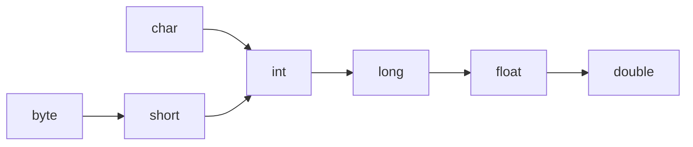

# 类型转换 Type Casting

类型系统通过各种机制和特性，如类型提升、泛型、自动装箱/拆箱、方法重载和重写等，确保了类型在操作中的一致性和兼容性。这些都是Java作为一种强类型语言的重要特征。

## 类型转换

### 自动类型转换

Widening

自动类型转换是指：数字表示范围小的数据类型可以自动转换成范围大的数据类型。

### 强制类型转换

强制类型转换我们再清楚不过了，即强制显示的把一个数据类型转换为另外一种数据类型。

如：

```text
short s = 199;
int i = s;// 199

double d = 10.24;
long ll = (long) d;// 10

int a = 30;
char c = (char) a;
```

以上的转换结果都在我们的预期之内，属于正常的转换和丢失精度的情况，下面的例子就一样属于数据溢出的情况。

```text
int ii = 300;
byte b = (byte)ii;
```

300 已经超出了 byte 类型表示的范围，所以会转换成一个毫无意义的数字（溢出的位直接丢掉）。

精度丢失

### 类型提升

数据类型按精度大小排序为：



类型提升：在多种不同数据类型的表达式中，类型会自动向范围表示大的值的数据类型提升。

把上面的溢出的例子再改下。

```java
int i = 100;    
long l = i;  // 无需类型转换
float f = l;  // long 自动提升为 float

byte b = 25;
int ni = b;   // byte 自动提升为 int

char ch = 'A';
int chi = ch; // char 自动提升为 int
```

当我们把精度（容量）大的数据类型赋值给精度（容量）小的数据类型，就会报错，反之则自动转换。

## 转型 Casting

### 向上转型

谢谢

### 向下转型

谢谢

## 类型对齐

