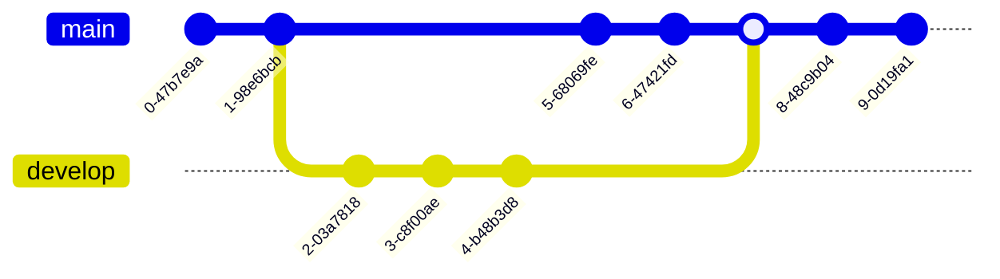

### 时间划分

非加试2个section

加试3个section

在Direction里面第一句说是2 section还是3 section，如果说3则遇到加试

（现在是非经典加试了，所以遇不到可以直接跳过的section了）

1对话+1讲座 11题，6.5m答题

1对话+2讲座 17题，10m答题

1对话+1讲座 11题，6.5m答题（加试）

顺序随机，全部认真作答

对话2.5-3m 5题

讲座4.5-5m 6题

读题目的时候，不计时，出现选项的时候计时

不可跳题、重复作答（不能重新做题）

### 讲座难度划分

1.0 版本，TPO靠前的文章（前20），真题里面没有

2.0 版本，TPO靠前的文章（前20）文章简单，但是题可能简单，可能复杂

3.0 逻辑复杂，理科性文章，大量真题

4.0 时间长，主要是艺术类的文章，很多时候不说人话（难听懂），只出现在新政的

可能出现的情况

1. 2.0+3.0+4.0
2. 3.0+3.0+4.0

### 题型分类

Basic Comprehension Questions

1. Gist-Content 数量最多
2. Gist-Purpose
3. Detail

Pragmatic Understanding Ouestions
4. Understanding the Function of What ls Said
5. Understanding the Speakers Attitude

Connecting Information Ouestions
6. Understanding Organization
7. Connecting Content
8. Making Inferencos

做笔记：思维导图

### 主旨句型

对话中

- I want to
- I need to
- I am wondering
- 疑问句：
- What can I do for you

Lecture

- Today, 
- 疑问句：

https://www.xiaohongshu.com/discovery/item/62a97c70000000001401915a

事实上，许多听力问题并不需要我们理解材料的每一个细节，而是要能够把握思路和文章的框架。因此，建议培养听短文的能力。这对托福听力提分非常重要，因为托福听力，尤其是讲座类，它不需要我们了解每一个细节，更重要的是教授的想法和全文的重要细节。

