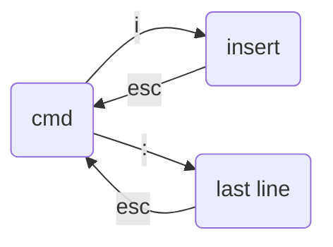

# VI

一开始是cmd模式

输入i(或者a,o)，进入编辑模式

### 状态：

- cmd

  命令模式

  如：j, k上下调光标

- insert

- Last line

  :

### CMD

jk上下

gg回到文件首

shift+gg 到文件尾

dd剪切、P粘贴

shift 6行首，

shift 4行尾

/：搜索

u：undo

**x：删除光标处的内容**

J：和下一行连接在一起（中间加空格）

教材vimtutor

### Last line

q!可以不存储就退出

wq

